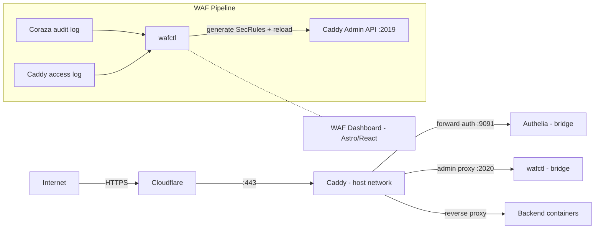

# caddy-compose

Docker Compose stack for a Caddy reverse proxy with Coraza WAF (OWASP CRS v4), Authelia 2FA, condition-based rate limiting, and a WAF management sidecar + dashboard.

## Architecture



Three containers run on separate Docker networks:

- **Caddy** uses `network_mode: host` and binds ports 80, 443, and 2019 (admin). It reaches backend containers by their static bridge IPs.
- **Authelia** sits on an isolated bridge network. Caddy calls it at `:9091` for forward authentication.
- **wafctl** sits on its own bridge network. It reads Coraza audit logs and Caddy access logs, generates SecRule config files, and reloads Caddy through a restricted admin proxy on `:2020`.

The WAF dashboard (Astro + React + shadcn/ui) is built as static files and served directly by Caddy.

## Quick start

### Prerequisites

- Docker and Docker Compose
- A domain with DNS managed by Cloudflare (for ACME DNS challenges and `dynamic_dns`)
- A Cloudflare API token with Zone:DNS:Edit permission

### 1. Clone and configure

```bash
git clone https://github.com/<your-org>/caddy-compose.git
cd caddy-compose
```

Create a `.env` file (SOPS-encrypted in production — see [Secrets](#secrets) below):

```bash
cat > .env <<'EOF'
CF_API_TOKEN=<your-cloudflare-api-token>
EMAIL=<your-email-for-acme>
EOF
```

### 2. Set up Authelia secrets

Authelia reads secrets from individual files, not environment variables. This keeps them out of `docker inspect` and `/proc/PID/environ`.

```bash
SECRETS_DIR=/path/to/authelia/secrets  # adjust to your host
mkdir -p "$SECRETS_DIR"
openssl rand -hex 32 > "$SECRETS_DIR/jwt_secret"
openssl rand -hex 32 > "$SECRETS_DIR/session_secret"
openssl rand -hex 32 > "$SECRETS_DIR/storage_encryption_key"
chmod 700 "$SECRETS_DIR"
chmod 600 "$SECRETS_DIR"/*
chown -R 1000:1000 "$SECRETS_DIR"
```

Generate a password hash and add it to `authelia/users_database.yml`:

```bash
docker run --rm authelia/authelia:latest \
  authelia crypto hash generate argon2 --password 'your_password'
```

### 3. Customize the Caddyfile

Open `Caddyfile` and replace the placeholder domain with your own. The file uses a `dynamic_dns` block to register subdomains with Cloudflare automatically, plus individual site blocks for each service. At minimum you need to:

1. Replace the domain in the `dynamic_dns` block and all site block addresses.
2. Update backend IPs/ports to match your container network layout.
3. Decide which services need Authelia protection (see [Site block patterns](#site-block-patterns) below).

### 4. Update image references

The Makefile, compose.yaml, and CI workflow all reference Docker Hub image names. Search for the current values and replace them with your own registry path:

```bash
# In Makefile (lines 17-18)
CADDY_IMAGE   ?= <your-registry>/caddy:2.2.1-2.11.1
WAFCTL_IMAGE  ?= <your-registry>/wafctl:1.2.1

# In compose.yaml — the image fields for caddy and wafctl services
# In .github/workflows/build.yml — the env block
```

### 5. Build and deploy

```bash
make build     # builds both images locally
make push      # pushes to your registry
make deploy    # build + scan + push + SCP config files + pull + restart on remote host
```

Or step by step:

```bash
make build-caddy       # caddy image only
make build-wafctl      # wafctl image only
make scp               # copy Caddyfile + compose.yaml to the remote host
make restart            # restart the stack on the remote host
```

See `make help` for all available targets.

### 6. Verify

```bash
make status   # container health on the remote host
make logs     # tail logs
curl -s https://your-waf-subdomain.example.com/api/health | jq .
```

## Configuration

### Makefile variables

Override any of these in a `.env.mk` file (gitignored) or inline:

```bash
make deploy REMOTE=myhost DEPLOY_MODE=compose
```

| Variable | Default | Description |
|---|---|---|
| `REMOTE` | (see Makefile) | SSH host alias or `user@host` for the target machine |
| `DEPLOY_MODE` | `dockge` | `dockge` (runs compose inside a Dockge container) or `compose` (direct `docker compose`) |
| `CADDY_IMAGE` | see Makefile | Full image:tag for the Caddy image |
| `WAFCTL_IMAGE` | see Makefile | Full image:tag for the wafctl image |
| `STACK_PATH` | `/opt/stacks/caddy/compose.yaml` | Path to the compose file on the remote host |
| `CADDYFILE_DEST` | see Makefile | Remote path where the Caddyfile is SCP'd |
| `COMPOSE_DEST` | see Makefile | Remote path where compose.yaml is SCP'd |

### Secrets

The `.env` file and `authelia/users_database.yml` are SOPS-encrypted with age. A pre-commit hook blocks commits containing unencrypted secrets by checking for SOPS `ENC[AES256_GCM,...]` markers. You can bypass this per-file with `.allow-unencrypted-paths` or globally with `.allow-unencrypted`.

### Version management

Image tags must stay in sync across five files:

- `Makefile` (lines 17-18: `CADDY_IMAGE`, `WAFCTL_IMAGE`)
- `compose.yaml` (lines 3 and 117: image fields)
- `test/docker-compose.test.yml` (line 3: caddy image)
- `.github/workflows/build.yml` (env block: `CADDY_TAG`, `WAFCTL_VERSION`)
- `README.md` (this file, examples and references)

Tag format: Caddy is `<project-version>-<caddy-version>` (e.g. `2.2.1-2.11.1`), wafctl is plain semver (e.g. `1.2.1`).

## WAF configuration

All WAF settings are managed through the dashboard or wafctl CLI. No hand-editing of SecRule files is needed.

A single `(waf)` Caddyfile snippet loads the Coraza WAF for any site block that imports it. Per-service settings (paranoia level, anomaly thresholds, WAF mode) are stored in `waf-config.json` and written to generated `.conf` files by wafctl.

WebSocket connections are handled gracefully. The initial HTTP upgrade request is inspected (phases 1-2), then response processing is skipped once the connection is hijacked. This is provided by a [fork of coraza-caddy](https://github.com/erfianugrah/coraza-caddy/tree/fix/websocket-hijack) ([upstream PR](https://github.com/corazawaf/coraza-caddy/pull/259)) that adds hijack tracking to the response interceptor.

### WAF modes

| Mode | Effect |
|------|--------|
| `enabled` | Full blocking. Requests exceeding anomaly thresholds get 403. |
| `detection_only` | Log only. Rules evaluate and log but never block. Thresholds forced to 10000. |
| `disabled` | No WAF processing. |

Per-service overrides let you run individual services in a different mode than the global default.

### Config loading order

Inside the `(waf)` snippet, files load in this order:

1. `pre-crs.conf` — baked-in defaults (body limits, JSON processor, XXE rules)
2. `custom-pre-crs.conf` — dynamic pre-CRS policy engine exclusions
3. CRS setup + detection rules
4. `custom-waf-settings.conf` — dynamic settings (engine mode, paranoia, thresholds, per-service overrides)
5. `post-crs.conf` — baked-in post-CRS rules
6. `custom-post-crs.conf` — dynamic post-CRS policy engine exclusions

### Config persistence

Dynamic config survives container restarts. wafctl stores state in JSON files on a Docker volume and regenerates all `.conf` files on boot (`generateOnBoot`). Caddy reads them fresh on its own startup, so a `docker compose restart` picks up changes without a manual deploy.

The entrypoint script also seeds the IPsum blocklist from a build-time snapshot if the runtime copy is missing.

### Reload fingerprint

When only included `.conf` files change (not the Caddyfile itself), Caddy's `/load` endpoint may skip reprovisioning. wafctl works around this by injecting a SHA-256 fingerprint comment into the Caddyfile before POSTing to `/load`. The on-disk Caddyfile is never modified.

## WAF dashboard

The dashboard is an Astro 5 + React 19 static site served by Caddy, protected by Authelia 2FA.

**Pages:**

- **Overview** — timeline chart with brush zoom (7 event types, unstacked), service breakdown donut, live event feed, top clients/services, stat cards linking to filtered views. Includes a CF-style filter bar with field/operator/value popover and filter chips.
- **Events** — paginated table of WAF + rate limit + IPsum events. Expandable rows with matched rules, request headers/body/args. JSON export. "Create Exception" button pre-fills a policy engine rule from the event context.
- **Policy Engine** — CRUD for WAF exclusions (allow, block, skip, honeypot, raw SecRule, and various CRS removal types). Condition builder with AND/OR logic. CRS rule catalog picker. Sparkline hit charts per rule.
- **Rate Limits** — condition-based rate limiting policy engine with per-path/method/header matching, flexible rate keys, auto-deploy, sparkline hit charts, import/export. Includes a **Rate Advisor** tab with statistical anomaly detection (MAD, Fano factor, IQR) that analyzes real traffic patterns and recommends rules with one-click creation. Global settings panel for jitter, sweep interval, and distributed rate limiting.
- **Blocklist** — IPsum threat intelligence stats, per-IP lookup, on-demand refresh.
- **Services** — per-service stats, top URIs, top triggered rules.
- **Investigate** — top blocked IPs, top URIs, top countries, IP lookup with GeoIP resolution.
- **Settings** — global and per-service WAF settings including full CRS v4 coverage (paranoia levels, anomaly thresholds, mode, allowed methods, content types, argument limits, file limits, blocked extensions, HTTP versions, restricted headers, CRS exclusion profiles). All fields have tooltips explaining their purpose. Deploy button with step-by-step progress.

Cross-page navigation ties everything together: clicking a stat card on Overview drills into Events, clicking an IP goes to Investigate, "Create Exception" from Events pre-fills the Policy Engine, and policy sparklines link back to Overview.

## wafctl

wafctl is both an HTTP API server and a CLI tool. When run without arguments (or with `serve`), it starts the API server. Otherwise it acts as a thin client that talks to a running instance.

It manages WAF configuration (including full CRS v4 settings), the WAF policy engine (exclusions with condition-based matching), condition-based rate limiting with a traffic advisor, IPsum blocklist operations, and GeoIP resolution with a three-tier lookup (Cloudflare header → local MMDB → online API).

### CLI usage

```
wafctl                  # start API server (default)
wafctl serve            # same as above
wafctl version          # print version
wafctl health           # check server health

wafctl config get       # show WAF configuration
wafctl config set       # update config (JSON on stdin or --file)

wafctl rules list       # list policy exclusion rules
wafctl rules get <id>   # get a rule by ID
wafctl rules create     # create rule (JSON on stdin or --file)
wafctl rules delete <id>

wafctl deploy           # deploy WAF config to Caddy
wafctl events           # list events (--hours, --limit, --service, --type, etc.)

wafctl ratelimit list       # list all rate limit rules (alias: rl)
wafctl ratelimit get <id>   # get a rate limit rule by ID
wafctl ratelimit create     # create rule (JSON on stdin or --file)
wafctl ratelimit delete <id>
wafctl ratelimit deploy     # deploy rate limit configs to Caddy
wafctl ratelimit global     # show global rate limit settings

wafctl blocklist stats
wafctl blocklist check <ip>
wafctl blocklist refresh
```

Flags: `--addr` (API address, default from `WAFCTL_ADDR` env), `--json` (raw JSON output), `--file`/`-f` (read input from file).

### API endpoints

| Group | Routes |
|-------|--------|
| Core | `GET /api/health`, `GET /api/summary`, `GET /api/events`, `GET /api/services` |
| Analytics | `GET /api/analytics/top-ips`, `GET /api/analytics/top-uris`, `GET /api/analytics/top-countries` |
| IP Lookup | `GET /api/lookup/{ip}` |
| Exclusions | `GET\|POST /api/exclusions`, `GET\|PUT\|DELETE /api/exclusions/{id}` |
| Exclusion ops | `GET /api/exclusions/export`, `POST /api/exclusions/import`, `POST /api/exclusions/generate`, `GET /api/exclusions/hits` |
| CRS | `GET /api/crs/rules`, `GET /api/crs/autocomplete` |
| Config | `GET\|PUT /api/config`, `POST /api/config/generate`, `POST /api/config/deploy` |
| RL Rules | `GET\|POST /api/rate-rules`, `GET\|PUT\|DELETE /api/rate-rules/{id}` |
| RL Rule ops | `POST /api/rate-rules/deploy`, `GET\|PUT /api/rate-rules/global`, `GET /api/rate-rules/export`, `POST /api/rate-rules/import`, `GET /api/rate-rules/hits` |
| RL Advisor | `GET /api/rate-rules/advisor?window=&service=&path=&method=&limit=` |
| RL Analytics | `GET /api/rate-limits/summary`, `GET /api/rate-limits/events` |
| Blocklist | `GET /api/blocklist/stats`, `GET /api/blocklist/check/{ip}`, `POST /api/blocklist/refresh` |

### Environment variables

All configurable via `envOr()` with sensible defaults:

| Variable | Default | Description |
|---|---|---|
| `WAFCTL_PORT` | `8080` | API server port |
| `WAF_CORS_ORIGINS` | `*` | Allowed CORS origins |
| `WAF_AUDIT_LOG` | — | Path to Coraza audit log |
| `WAF_COMBINED_ACCESS_LOG` | — | Path to Caddy combined access log |
| `WAF_EXCLUSIONS_FILE` | — | Path to exclusions JSON store |
| `WAF_CONFIG_FILE` | — | Path to WAF config JSON store |
| `WAF_RATELIMIT_FILE` | — | Path to rate limit JSON store |
| `WAF_CORAZA_DIR` | — | Output dir for generated WAF configs |
| `WAF_RATELIMIT_DIR` | — | Output dir for generated rate limit configs |
| `WAF_CADDY_ADMIN_URL` | `http://caddy:2019` | Caddy admin API endpoint |
| `WAF_EVENT_FILE` | `/data/events.jsonl` | JSONL persistence for WAF events |
| `WAF_ACCESS_EVENT_FILE` | `/data/access-events.jsonl` | JSONL persistence for access log events |
| `WAF_EVENT_MAX_AGE` | `2160h` (90 days) | Event retention period |
| `WAF_TAIL_INTERVAL` | `5s` | Log tail polling interval |
| `WAF_GEOIP_DB` | `/data/geoip/country.mmdb` | Path to MMDB file for GeoIP lookups |
| `WAF_GEOIP_API_URL` | (disabled) | Online GeoIP API URL (e.g. `https://ipinfo.io/%s/json`) |
| `WAF_GEOIP_API_KEY` | (empty) | Bearer token for online GeoIP API |
| `WAF_AUDIT_OFFSET_FILE` | `/data/.audit-log-offset` | Persists audit log read offset across restarts |
| `WAF_ACCESS_OFFSET_FILE` | `/data/.access-log-offset` | Persists access log read offset across restarts |
| `WAF_CADDYFILE_PATH` | `/data/Caddyfile` | Path to Caddyfile for RL auto-discovery |

## Site block patterns

Since Caddy runs with `network_mode: host`, it reaches backend containers by their static bridge IPs. Every site block imports a standard set of snippets. Three patterns cover most use cases:

### Pattern A: no authentication

For public services or services with their own auth:

```
myservice.example.com {
    import cors
    import security_headers
    import static_cache
    import ipsum_blocklist
    import waf
    import /data/caddy/rl/myservice_rl*.caddy
    import tls_config
    encode zstd gzip
    reverse_proxy <backend-ip>:<port> {
        import proxy_headers
    }
    import error_pages
    import site_log myservice
}
```

### Pattern B: full Authelia protection

Every request must pass through Authelia:

```
myservice.example.com {
    import cors
    import security_headers
    import static_cache
    import ipsum_blocklist
    import waf
    import forward_auth
    import /data/caddy/rl/myservice_rl*.caddy
    import tls_config
    encode zstd gzip
    reverse_proxy <backend-ip>:<port> {
        import proxy_headers
    }
    import error_pages
    import site_log myservice
}
```

### Pattern C: mixed (some paths bypass auth)

Use `route` to control evaluation order. Matching requests hit the first `reverse_proxy` and skip auth:

```
myservice.example.com {
    import cors
    import security_headers
    import static_cache
    import ipsum_blocklist
    import waf
    import /data/caddy/rl/myservice_rl*.caddy
    import tls_config
    encode zstd gzip

    route {
        @public path /api/* /webhooks/*
        reverse_proxy @public <backend-ip>:<port> {
            import proxy_headers
        }

        forward_auth <authelia-ip>:9091 {
            uri /api/authz/forward-auth
            copy_headers Remote-User Remote-Groups Remote-Email Remote-Name
        }

        reverse_proxy <backend-ip>:<port> {
            import proxy_headers
        }
    }
    import error_pages
    import site_log myservice
}
```

### Required snippets

Every site block should include these, in order:

| Snippet | Required | Purpose |
|---------|----------|---------|
| `import cors` | recommended | CORS preflight handling |
| `import security_headers` | yes | HSTS, CSP, nosniff, etc. |
| `import static_cache` | recommended | Cache-Control for static assets |
| `import ipsum_blocklist` | yes | Block known-malicious IPs |
| `import waf` or `import waf_off` | yes | Coraza WAF with OWASP CRS |
| `import forward_auth` | if authenticated | Authelia forward authentication |
| `import /data/caddy/rl/<name>_rl*.caddy` | yes | Rate limiting (no-op until configured) |
| `import tls_config` | yes | ACME DNS challenge via Cloudflare |
| `encode zstd gzip` | recommended | Response compression |
| `import error_pages` | yes | Custom error page templates |
| `import site_log <name>` | yes | JSON access log + combined log for analytics |

Rate limit rules are managed by wafctl. On boot it creates placeholder `.caddy` files for any service it detects in the Caddyfile, so the glob import works without manual setup. Rules support condition-based matching (per-path, per-method, per-header), flexible rate keys (client IP, path, header values), and auto-deploy on save.

## Security hardening

### Container security

| Feature | Caddy | Authelia | wafctl |
|---------|-------|----------|--------|
| `read_only: true` | yes | yes | yes |
| `cap_drop: ALL` | yes | yes | yes |
| `cap_add` | `NET_BIND_SERVICE`, `DAC_OVERRIDE` | none | none |
| `no-new-privileges` | yes | yes | yes |
| `user` | root (needs port 443) | `1000:1000` | `65534` (nobody) |
| Healthcheck | yes | yes | yes |
| Resource limits | 8 CPU / 2048M | 1 CPU / 256M | 0.5 CPU / 128M |

### Additional layers

- **IPsum blocklist** — ~20k known-malicious IPs, baked in at build time, updated daily by cron, refreshable on demand from the dashboard.
- **Cloudflare trusted proxies** — IP ranges fetched at build time so Caddy resolves the real client IP from `X-Forwarded-For`.
- **Security headers** — HSTS (2yr, preload), nosniff, SAMEORIGIN, strict referrer, permissions-policy, COOP, CORP, baseline CSP.
- **ECH** (Encrypted Client Hello) — hides SNI from network observers.
- **Admin API** locked to localhost.
- **Strict SNI** host checking.

### Image supply chain

The CI pipeline (GitHub Actions) includes:
- **Trivy** vulnerability scanning (CRITICAL + HIGH gate)
- **Cosign** keyless image signing via Sigstore/Fulcio OIDC
- **Syft** SBOM generation (SPDX + CycloneDX) attached as cosign attestations

## Testing

```bash
make test              # all tests (Go + frontend)
make test-go           # Go tests only (744 tests across 16 files)
make test-frontend     # Vitest frontend tests (265 tests across 6 files)
```

Run a single test:

```bash
# Go
cd wafctl && go test -run TestFunctionName -count=1 -timeout 60s ./...

# Frontend
cd waf-dashboard && npx vitest run -t "test description"
```

## File structure

```
caddy-compose/
  Caddyfile              # Caddy config (snippets + site blocks)
  Dockerfile             # 6-stage multi-stage build (uses erfianugrah/coraza-caddy fork)
  Makefile               # Build, push, deploy, test, WAF operations
  compose.yaml           # Caddy + Authelia + wafctl services
  .env                   # SOPS-encrypted secrets (CF token, email)
  authelia/
    configuration.yml    # Authelia config
    users_database.yml   # SOPS-encrypted user/password hashes
  coraza/
    pre-crs.conf         # Pre-CRS WAF rules (body settings, XXE, etc.)
    post-crs.conf        # Post-CRS WAF rules (RCE, CRLF)
  errors/
    error.html           # Custom error page template
  scripts/
    entrypoint.sh        # Container entrypoint (crond + caddy run)
    rotate-audit-log.sh  # Hourly audit log rotation (256 MB copytruncate)
    update-geoip.sh      # GeoIP database updater
    update-ipsum.sh      # IPsum blocklist updater
  wafctl/                # Go sidecar (zero external dependencies)
    main.go              # HTTP handlers, routes, filter system
    cli.go               # CLI subcommand framework
    models.go            # Data models (WAF, RL, exclusion, event types)
    config.go            # WAF config store (CRS v4 extended settings)
    exclusions.go        # Policy engine exclusion store + shared condition validation
    generator.go         # SecRule generation (CRS v4 setvar, BPL/DPL resolution)
    logparser.go         # Audit log parser, event summarization
    rl_rules.go          # Rate limit rule store (CRUD, validation, v1 migration)
    rl_generator.go      # Rate limit Caddy config generator (matchers, keys)
    rl_analytics.go      # Access log parser, condition-based 429 attribution
    rl_advisor.go        # Rate advisor (anomaly detection, caching, baselines)
    deploy.go            # Deploy pipeline (write + fingerprint + reload)
    blocklist.go         # IPsum blocklist management
    geoip.go             # Pure-Go MMDB reader, GeoIP resolution
    crs_rules.go         # CRS rule catalog (141 rules, 11 categories)
    *_test.go            # 16 test files (744 tests)
    Dockerfile           # Standalone wafctl image
    go.mod
  waf-dashboard/         # Astro 5 + React 19 + shadcn/ui frontend
    src/
      components/        # Dashboard components
        RateLimitsPanel.tsx   # RL rules CRUD + global settings
        RateAdvisorPanel.tsx  # Rate advisor UI (form, client table, recommendations)
        AdvisorCharts.tsx     # Advisor visualizations (histograms, impact curves, ToD chart)
        SettingsPanel.tsx     # WAF settings with CRS v4 fields + tooltips
        policy/          # Policy engine sub-modules
        ui/              # shadcn/ui primitives
      lib/
        api.ts           # API client with snake_case -> camelCase mapping
      pages/             # Astro file-based routing (8 pages)
    package.json
    astro.config.mjs
    vitest.config.ts
  test/
    docker-compose.test.yml
    Caddyfile.test
  .github/
    workflows/
      build.yml          # CI: build, scan, push, sign, SBOM
```

## Operations

```bash
make status            # container health on remote host
make logs              # tail all container logs
make waf-config        # show current WAF settings from remote
make waf-deploy        # trigger WAF config deploy + Caddy reload
```

### Reload Caddy without restart

```bash
scp Caddyfile <remote>:/path/to/caddy/Caddyfile
ssh <remote> 'docker exec caddy caddy reload --config /etc/caddy/Caddyfile --adapter caddyfile'
```
