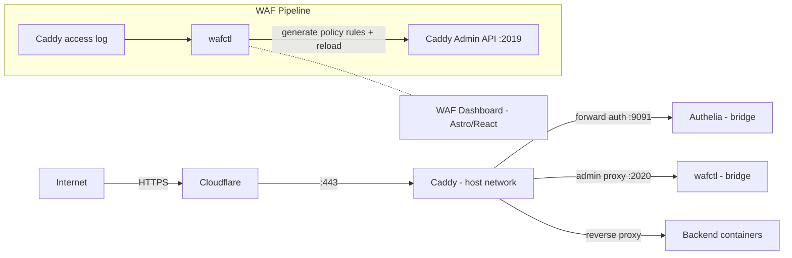

# caddy-compose

Docker Compose stack for a Caddy reverse proxy with a custom policy engine WAF (OWASP CRS v4), Authelia 2FA, condition-based rate limiting, and a WAF management sidecar + dashboard.

## Architecture


```mermaid
graph LR
    Internet -->|HTTPS| CF[Cloudflare]
    CF -->|:443| Caddy[Caddy - host network]
    Caddy -->|forward auth :9091| Authelia[Authelia - bridge]
    Caddy -->|admin proxy :2020| wafctl[wafctl - bridge]
    Caddy -->|reverse proxy| Backends[Backend containers]

    subgraph WAF Pipeline
        direction TB
        AccessLog[Caddy access log] --> wafctl2[wafctl]
        wafctl2 -->|generate policy rules + reload| CaddyAdmin[Caddy Admin API :2019]
    end

    wafctl2 -.- Dashboard[WAF Dashboard - Astro/React]
```

Three containers run on separate Docker networks:

- **Caddy** uses `network_mode: host` and binds ports 80, 443, and 2019 (admin). It reaches backend containers by their static bridge IPs.
- **Authelia** sits on an isolated bridge network. Caddy calls it at `:9091` for forward authentication.
- **wafctl** sits on its own bridge network. It reads Caddy access logs, generates policy engine rules, and reloads Caddy through a restricted admin proxy on `:2020`. The WAF dashboard (Astro + React + shadcn/ui) is bundled into the wafctl image and served by it.

## Quick start

### Prerequisites

- Docker and Docker Compose
- A domain with DNS managed by Cloudflare (for ACME DNS challenges and `dynamic_dns`)
- A Cloudflare API token with Zone:DNS:Edit permission

### 1. Clone and configure

```bash
git clone https://github.com/<your-org>/caddy-compose.git
cd caddy-compose
```

Create a `.env` file (SOPS-encrypted in production — see [Secrets](#secrets) below):

```bash
cat > .env <<'EOF'
CF_API_TOKEN=<your-cloudflare-api-token>
EMAIL=<your-email-for-acme>
EOF
```

### 2. Set up Authelia secrets

Authelia reads secrets from individual files, not environment variables. This keeps them out of `docker inspect` and `/proc/PID/environ`.

```bash
SECRETS_DIR=/path/to/authelia/secrets  # adjust to your host
mkdir -p "$SECRETS_DIR"
openssl rand -hex 32 > "$SECRETS_DIR/jwt_secret"
openssl rand -hex 32 > "$SECRETS_DIR/session_secret"
openssl rand -hex 32 > "$SECRETS_DIR/storage_encryption_key"
chmod 700 "$SECRETS_DIR"
chmod 600 "$SECRETS_DIR"/*
chown -R 1000:1000 "$SECRETS_DIR"
```

Generate a password hash and add it to `authelia/users_database.yml`:

```bash
docker run --rm authelia/authelia:latest \
  authelia crypto hash generate argon2 --password 'your_password'
```

### 3. Customize the Caddyfile

Open `Caddyfile` and replace the placeholder domain with your own. The file uses a `dynamic_dns` block to register subdomains with Cloudflare automatically, plus individual site blocks for each service. At minimum you need to:

1. Replace the domain in the `dynamic_dns` block and all site block addresses.
2. Update backend IPs/ports to match your container network layout.
3. Decide which services need Authelia protection (see [Site block patterns](#site-block-patterns) below).

### 4. Update image references

The Makefile, compose.yaml, and CI workflow all reference Docker Hub image names. Search for the current values and replace them with your own registry path:

```bash
# In Makefile (lines 17-18)
CADDY_IMAGE   ?= <your-registry>/caddy:3.85.0-2.11.2
WAFCTL_IMAGE  ?= <your-registry>/wafctl:2.89.0

# In compose.yaml — the image fields for caddy and wafctl services
# In .github/workflows/build.yml — the env block
```

### 5. Build and deploy

```bash
make build     # builds both images locally
make push      # pushes to your registry
make deploy    # build + scan + push + SCP config files + pull + restart on remote host
```

Or step by step:

```bash
make build-caddy       # caddy image only
make build-wafctl      # wafctl image only
make scp               # copy Caddyfile + compose.yaml to the remote host
make restart            # restart the stack on the remote host
```

See `make help` for all available targets.

### 6. Verify

```bash
make status   # container health on the remote host
make logs     # tail logs
curl -s https://your-waf-subdomain.example.com/api/health | jq .
```

## Configuration

### Makefile variables

Override any of these in a `.env.mk` file (gitignored) or inline:

```bash
make deploy REMOTE=myhost DEPLOY_MODE=compose
```

| Variable | Default | Description |
|---|---|---|
| `REMOTE` | (see Makefile) | SSH host alias or `user@host` for the target machine |
| `DEPLOY_MODE` | `dockge` | `dockge` (runs compose inside a Dockge container) or `compose` (direct `docker compose`) |
| `CADDY_IMAGE` | see Makefile | Full image:tag for the Caddy image |
| `WAFCTL_IMAGE` | see Makefile | Full image:tag for the wafctl image |
| `STACK_PATH` | `/opt/stacks/caddy/compose.yaml` | Path to the compose file on the remote host |
| `CADDYFILE_DEST` | see Makefile | Remote path where the Caddyfile is SCP'd |
| `COMPOSE_DEST` | see Makefile | Remote path where compose.yaml is SCP'd |

### Secrets

The `.env` file and `authelia/users_database.yml` are SOPS-encrypted with age. A pre-commit hook blocks commits containing unencrypted secrets by checking for SOPS `ENC[AES256_GCM,...]` markers. You can bypass this per-file with `.allow-unencrypted-paths` or globally with `.allow-unencrypted`.

### Version management

Image tags must stay in sync across four files:

- `Makefile` (lines 17-18: `CADDY_IMAGE`, `WAFCTL_IMAGE`)
- `compose.yaml` (lines 3 and 119: image fields)
- `.github/workflows/build.yml` (env block: `CADDY_TAG`, `WAFCTL_VERSION`)
- `README.md` (this file, examples and references)

Tag format: Caddy is `<project-version>-<caddy-version>` (e.g. `3.78.0-2.11.2`), wafctl is plain semver (e.g. `2.82.0`).

## WAF configuration

All WAF settings are managed through the dashboard or wafctl CLI.

A custom [caddy-policy-engine](https://github.com/erfianugrah/caddy-policy-engine) plugin evaluates allow/block/honeypot/detect rules and handles rate limiting. The plugin uses hash-set lookups for `in` operator matching. Rules are hot-reloaded from `policy-rules.json` without Caddy restarts.

A custom [caddy-body-matcher](https://github.com/erfianugrah/caddy-body-matcher) plugin provides request body matching (raw, JSON, form) and a `body_vars` handler that extracts body field values as Caddy placeholders. This enables body-aware rate limiting (e.g., rate limit by a JSON API key field) and body-based WAF conditions.

### WAF modes

| Mode | Effect |
|------|--------|
| `enabled` | Full blocking. Requests exceeding anomaly thresholds get 403. |
| `detection_only` | Log only. Rules evaluate and log but never block. Thresholds forced to 10000. |
| `disabled` | No WAF processing. |

Per-service overrides let you run individual services in a different mode than the global default.

### Config persistence

Dynamic config survives container restarts. wafctl stores state in JSON files on a Docker volume and regenerates `policy-rules.json` on boot (`generateOnBoot`). The policy engine plugin detects mtime changes and hot-reloads rules automatically.

### Reload fingerprint

When only included `.conf` files change (not the Caddyfile itself), Caddy's `/load` endpoint may skip reprovisioning. wafctl works around this by injecting a SHA-256 fingerprint comment into the Caddyfile before POSTing to `/load`. The on-disk Caddyfile is never modified.

### Challenge (PoW) protection

Challenge rules serve a proof-of-work interstitial (SHA-256 hashcash) that clients must solve before reaching the upstream. The interstitial runs in Web Workers for parallelism, with a pure-JS SHA-256 fallback for non-secure contexts. On success, an HMAC-signed cookie bypasses the challenge on subsequent requests.

**Bot scoring** runs during the PoW computation window — 6 layers: JA4 TLS fingerprint, HTTP headers, 13 JS environment probes, behavioral signals (mouse/keyboard/scroll/focus/worker-timing-variance), spatial inconsistency, and timing validation. Score >= 70 rejects even with a valid PoW.

**Challenge rule fields:**

| Field | Default | Description |
|-------|---------|-------------|
| `challenge_difficulty` | 4 | Static difficulty (1-16). SHA-256 leading hex zeros. 4 ≈ 0.5s, 6 ≈ 5s, 8 ≈ 30s. **Ignored when adaptive range is active.** |
| `challenge_min_difficulty` | 0 (disabled) | Adaptive minimum (1-16). Easiest puzzle for clean browsers (good JA4, proper headers). Set both min and max to enable adaptive mode. |
| `challenge_max_difficulty` | 0 (disabled) | Adaptive maximum (1-16). Hardest puzzle for suspicious clients (no ALPN, missing Sec-Fetch). Server picks per-request via `preSignalScore()`. |
| `challenge_algorithm` | "fast" | "fast" = native WebCrypto speed. "slow" = 10ms delay per hash iteration, penalizes all clients equally. **Orthogonal to difficulty** — does not interact with adaptive range. Caution: slow + difficulty > 2 causes multi-minute solves for real users. |
| `challenge_ttl` | "1h" | Cookie lifetime before re-challenge. Accepts extended durations: "1h", "4h", "24h", "7d". |
| `challenge_bind_ip` | true | Invalidates cookie if client IP changes. Disable for mobile users on cellular networks. |
| `challenge_bind_ja4` | true | Invalidates cookie if JA4 TLS fingerprint changes. Prevents cookie replay from a different TLS stack (e.g., solve in browser, replay from curl). |

**How difficulty selection works:**
- If `challenge_min_difficulty` and `challenge_max_difficulty` are both 0 → static mode: all clients get `challenge_difficulty`.
- If both are > 0 → adaptive mode: the server runs `preSignalScore(request)` using JA4/TLS (L1), HTTP headers (L2), and UA spatial checks (partial L5). Score 0 → min difficulty, score >= 70 → max difficulty, proportional in between. `challenge_difficulty` is ignored.
- If only one is set, the other defaults to `challenge_difficulty`.

**Timing validation** (automatic, no configuration needed): the server computes a minimum expected solve time from the difficulty and the client's reported `navigator.hardwareConcurrency`. Solutions faster than floor/3 are hard-rejected (physically impossible). Solutions faster than floor get a +40 bot score penalty.

**Expected solve times** (median, assuming parallel Web Workers):

| Difficulty | Fast (8 cores) | Slow (8 cores) | Slow (1 core) |
|:---:|---:|---:|---:|
| 1 | instant | ~10ms | ~80ms |
| 2 | instant | ~160ms | ~1.3s |
| 3 | instant | ~2.6s | ~20s |
| 4 | ~0.04ms | ~41s | ~5.5 min |
| 5 | ~0.7ms | ~10.9 min | ~1.5 hours |
| 6 | ~10ms | ~2.9 hours | ~23.3 hours |
| 7 | ~168ms | ~1.9 days | ~15.5 days |
| 8 | ~2.7s | ~31 days | ~248 days |

Fast mode uses native WebCrypto (~2μs/hash). Slow mode adds a 10ms `setTimeout` per iteration, making it orthogonal to difficulty — the hash space is the same, each iteration just takes longer. **Slow + difficulty > 2 is effectively unsolvable** for most clients.

**Challenge analytics** dashboard at `/challenge`: funnel (issued/passed/failed/bypassed with rates), bot score distribution histogram, hourly timeline, per-algorithm breakdown (fast vs slow with avg solve time and avg difficulty), expected solve time reference table, top challenged clients (with unique token counts and avg/max bot scores), top challenged services (with fail rates), top JA4 fingerprints. Supports `service` and `client` filters. API: `GET /api/challenge/stats?hours=24&service=x&client=y`.

**Per-event enrichment**: security events show the algorithm, difficulty, actual solve time, and expected solve time (with 8-core estimate) for comparison. Events that solved faster than expected are flagged.

## WAF dashboard

The dashboard is an Astro 6 + React 19 static site bundled in the wafctl image and served by wafctl, protected by Authelia 2FA.

**Pages:**

- **Overview** — timeline chart with brush zoom (7 event types, unstacked), service breakdown donut, live event feed, top clients/services, stat cards linking to filtered views. Includes a CF-style filter bar with field/operator/value popover and filter chips.
- **Events** — paginated table of WAF + rate limit + IPsum events. Expandable rows with matched rules, request headers/body/args. JSON export. "Create Exception" button pre-fills a policy engine rule from the event context.
- **Policy Engine** — CRUD for WAF exclusions (allow, block, skip, raw SecRule, and various CRS removal types). Condition builder with AND/OR logic. Tag-based classification. CRS rule catalog picker. Sparkline hit charts per rule.
- **Rate Limits** — condition-based rate limiting policy engine with per-path/method/header matching, flexible rate keys, auto-deploy, sparkline hit charts, import/export. Includes a **Rate Advisor** tab with statistical anomaly detection (MAD, Fano factor, IQR) that analyzes real traffic patterns and recommends rules with one-click creation. Global settings panel for jitter, sweep interval, and distributed rate limiting.
- **Managed Lists** — reusable named lists (IPs, paths, user agents, etc.) referenced by WAF and rate limit conditions via `in_list`/`not_in_list` operators. Full CRUD with search, inline editing, import/export. Includes IPsum blocklist stats, per-IP lookup, and on-demand refresh.
- **CSP** — per-service Content Security Policy management with directive editor, source input, live preview, set/default/none modes, report-only, global enable/disable.
- **Logs** — general Caddy log viewer with stream tab, summary aggregation, and header compliance analysis.
- **Services** — per-service stats, top URIs, top triggered rules.
- **Challenge Analytics** — PoW challenge funnel (issued/passed/failed/bypassed), bot score distribution histogram, hourly timeline, top challenged clients with unique token counts and bot score averages, top challenged services with fail rates, top JA4 TLS fingerprints. Service and client filters with click-to-filter tables.
- **Sessions** — session behavioral tracking dashboard. Per-session signal analysis (mouse, scroll, keystroke, focus, navigation timing), bot score breakdown, session alerts, JTI denylist management. Configurable scoring weights and auto-escalation thresholds.
- **Investigate** — top blocked IPs, top URIs, top countries, IP lookup with GeoIP resolution.
- **Settings** — global and per-service WAF settings including full CRS v4 coverage (paranoia levels, anomaly thresholds, mode, allowed methods, content types, argument limits, file limits, blocked extensions, HTTP versions, restricted headers, CRS exclusion profiles). All fields have tooltips explaining their purpose. Deploy button with step-by-step progress.

Cross-page navigation ties everything together: clicking a stat card on Overview drills into Events, clicking an IP goes to Investigate, "Create Exception" from Events pre-fills the Policy Engine, and policy sparklines link back to Overview.

## wafctl

wafctl is both an HTTP API server and a CLI tool. When run without arguments (or with `serve`), it starts the API server. Otherwise it acts as a thin client that talks to a running instance.

It manages WAF configuration (including full CRS v4 settings), the WAF policy engine (exclusions with condition-based matching and tag-based classification), managed lists (reusable value sets for conditions), condition-based rate limiting with a traffic advisor, IPsum blocklist operations, and GeoIP resolution with a three-tier lookup (Cloudflare header → local MMDB → online API).

### CLI usage

```
wafctl                  # start API server (default)
wafctl serve            # same as above
wafctl version          # print version
wafctl health           # check server health

wafctl config get       # show WAF configuration
wafctl config set       # update config (JSON on stdin or --file)

wafctl rules list       # list policy exclusion rules
wafctl rules get <id>   # get a rule by ID
wafctl rules create     # create rule (JSON on stdin or --file)
wafctl rules delete <id>

wafctl deploy           # deploy WAF config to Caddy
wafctl events           # list events (--hours, --limit, --service, --type, etc.)

wafctl ratelimit list       # list all rate limit rules (alias: rl)
wafctl ratelimit get <id>   # get a rate limit rule by ID
wafctl ratelimit create     # create rule (JSON on stdin or --file)
wafctl ratelimit delete <id>
wafctl ratelimit deploy     # deploy rate limit configs to Caddy
wafctl ratelimit global     # show global rate limit settings

wafctl csp get              # show CSP configuration
wafctl csp set              # update config (JSON on stdin or --file)
wafctl csp deploy           # deploy CSP configs to Caddy
wafctl csp preview          # preview rendered CSP headers per service

wafctl lists list           # list all managed lists (alias: ls)
wafctl lists get <id>       # get a managed list by ID
wafctl lists create         # create list (JSON on stdin or --file)
wafctl lists delete <id>

wafctl blocklist stats
wafctl blocklist check <ip>
wafctl blocklist refresh
```

Flags: `--addr` (API address, default from `WAFCTL_ADDR` env), `--json` (raw JSON output), `--file`/`-f` (read input from file).

### API endpoints

| Group | Routes |
|-------|--------|
| Core | `GET /api/health`, `GET /api/summary`, `GET /api/events`, `GET /api/services` |
| Analytics | `GET /api/analytics/top-ips`, `GET /api/analytics/top-uris`, `GET /api/analytics/top-countries` |
| IP Lookup | `GET /api/lookup/{ip}` |
| Exclusions | `GET\|POST /api/exclusions`, `GET\|PUT\|DELETE /api/exclusions/{id}` |
| Exclusion ops | `GET /api/exclusions/export`, `POST /api/exclusions/import`, `POST /api/exclusions/generate`, `GET /api/exclusions/hits`, `PUT /api/exclusions/reorder` |
| CRS | `GET /api/crs/rules` |
| Config | `GET\|PUT /api/config`, `POST /api/config/generate`, `POST /api/config/validate`, `POST /api/config/deploy` |
| RL Rules | `GET\|POST /api/rate-rules`, `GET\|PUT\|DELETE /api/rate-rules/{id}` |
| RL Rule ops | `POST /api/rate-rules/deploy`, `GET\|PUT /api/rate-rules/global`, `GET /api/rate-rules/export`, `POST /api/rate-rules/import`, `GET /api/rate-rules/hits`, `PUT /api/rate-rules/reorder` |
| RL Advisor | `GET /api/rate-rules/advisor?window=&service=&path=&method=&limit=` |
| RL Analytics | `GET /api/rate-limits/summary`, `GET /api/rate-limits/events` |
| Managed Lists | `GET\|POST /api/lists`, `GET\|PUT\|DELETE /api/lists/{id}` |
| CSP | `GET\|PUT /api/csp`, `POST /api/csp/deploy`, `GET /api/csp/preview` |
| General Logs | `GET /api/logs`, `GET /api/logs/summary` |
| CF Proxy | `GET /api/cfproxy/stats`, `POST /api/cfproxy/refresh` |
| Sessions | `GET /api/sessions/stats`, `GET /api/sessions/list`, `GET /api/sessions/{jti}`, `GET /api/sessions/alerts`, `GET\|PUT /api/sessions/config` |
| Blocklist | `GET /api/blocklist/stats`, `GET /api/blocklist/check/{ip}`, `POST /api/blocklist/refresh` |

### Environment variables

All configurable via `envOr()` with sensible defaults:

| Variable | Default | Description |
|---|---|---|
| `WAFCTL_PORT` | `8080` | API server port |
| `WAF_CORS_ORIGINS` | `*` | Allowed CORS origins |
| `WAF_AUDIT_LOG` | — | Path to audit log (legacy, unused) |
| `WAF_COMBINED_ACCESS_LOG` | — | Path to Caddy combined access log |
| `WAF_EXCLUSIONS_FILE` | — | Path to exclusions JSON store |
| `WAF_CONFIG_FILE` | — | Path to WAF config JSON store |
| `WAF_RATELIMIT_FILE` | — | Path to rate limit JSON store |
| `WAF_CADDY_ADMIN_URL` | `http://caddy:2019` | Caddy admin API endpoint |
| `WAF_EVENT_FILE` | `/data/events.jsonl` | JSONL persistence for WAF events |
| `WAF_ACCESS_EVENT_FILE` | `/data/access-events.jsonl` | JSONL persistence for access log events |
| `WAF_EVENT_MAX_AGE` | `2160h` (90 days) | Event retention period |
| `WAF_TAIL_INTERVAL` | `5s` | Log tail polling interval |
| `WAF_GEOIP_DB` | `/data/geoip/country.mmdb` | Path to MMDB file for GeoIP lookups |
| `WAF_GEOIP_API_URL` | (disabled) | Online GeoIP API URL (e.g. `https://ipinfo.io/%s/json`) |
| `WAF_GEOIP_API_KEY` | (empty) | Bearer token for online GeoIP API |
| `WAF_AUDIT_OFFSET_FILE` | `/data/.audit-log-offset` | Persists audit log read offset (legacy) |
| `WAF_ACCESS_OFFSET_FILE` | `/data/.access-log-offset` | Persists access log read offset across restarts |
| `WAF_CADDYFILE_PATH` | `/data/Caddyfile` | Path to Caddyfile for service FQDN resolution |
| `WAF_CSP_FILE` | `/data/csp-config.json` | CSP configuration store path |
| `WAF_GENERAL_LOG_FILE` | `/data/general-events.jsonl` | JSONL persistence for general log events |
| `WAF_GENERAL_LOG_OFFSET_FILE` | `/data/.general-log-offset` | Persists general log read offset across restarts |
| `WAF_GENERAL_LOG_MAX_AGE` | `168h` (7 days) | Retention period for general log events |
| `WAF_BLOCKLIST_REFRESH_HOUR` | `6` | UTC hour (0–23) for daily IPsum blocklist refresh |
| `WAF_MANAGED_LISTS_FILE` | `/data/lists.json` | Managed lists store path |
| `WAF_MANAGED_LISTS_DIR` | `/data/lists` | Output dir for managed list files |
| `WAF_SESSION_FILE` | `/data/sessions.json` | Session behavioral tracking data store path |
| `WAF_SESSION_CONFIG_FILE` | `/data/session-config.json` | Session scoring configuration store path |
| `WAF_POLICY_RULES_FILE` | `/data/waf/policy-rules.json` | Policy engine rules JSON output path |

## Event store sizing

wafctl maintains three event stores in JSONL format. Sizing depends on traffic
volume and retention period.

### Stores

| Store | File | Default Retention | Contents |
|-------|------|-------------------|----------|
| WAF events | `events.jsonl` | 90 days (`WAF_EVENT_MAX_AGE`) | CRS detect/block events |
| Access log events | `access-events.jsonl` | 90 days (`WAF_EVENT_MAX_AGE`) | Policy blocks, rate limits, detects, skips |
| General log events | `general-events.jsonl` | 7 days (`WAF_GENERAL_LOG_MAX_AGE`) | All access log entries (high volume) |

### Disk usage estimates

| Traffic level | Events/day | 90-day WAF+Access store | 7-day General store |
|---------------|-----------|------------------------|---------------------|
| Low (100 req/hr) | ~50 events | ~5 MB | ~50 MB |
| Medium (1K req/hr) | ~500 events | ~50 MB | ~500 MB |
| High (10K req/hr) | ~5,000 events | ~500 MB | ~5 GB |
| Very high (100K req/hr) | ~50,000 events | ~5 GB | ~50 GB |

Events are ~1 KB each (JSON with headers, matched rules, tags).
General log entries are ~500 bytes each (request metadata only).

### Tuning

- **Reduce retention**: Set `WAF_EVENT_MAX_AGE=720h` (30 days) or `168h` (7 days)
- **Reduce general log retention**: `WAF_GENERAL_LOG_MAX_AGE=24h` (1 day)
- **Disable general logging**: Don't set `WAF_GENERAL_LOG_FILE`
- **Monitor disk usage**: Check `/data/events/` directory size periodically
- **Eviction is automatic**: Events older than max age are pruned on each tail cycle

### Memory usage

Events are held in memory for fast querying. Incremental summary counters
(per-hour buckets) reduce memory pressure from full scans. Approximate memory:

- 10K events in memory: ~15 MB
- 100K events in memory: ~150 MB
- 1M events in memory: ~1.5 GB

For high-traffic deployments, reduce `WAF_EVENT_MAX_AGE` to keep memory bounded.

## Site block patterns

Since Caddy runs with `network_mode: host`, it reaches backend containers by their static bridge IPs. Every site block imports a standard set of snippets. Three patterns cover most use cases:

### Pattern A: no authentication

For public services or services with their own auth:

```
myservice.example.com {
    import waf
    import tls_config
    encode zstd gzip
    reverse_proxy <backend-ip>:<port> {
        import proxy_headers
    }
    import error_pages
    import site_log myservice
}
```

### Pattern B: full Authelia protection

Every request must pass through Authelia:

```
myservice.example.com {
    import waf
    import forward_auth
    import tls_config
    encode zstd gzip
    reverse_proxy <backend-ip>:<port> {
        import proxy_headers
    }
    import error_pages
    import site_log myservice
}
```

### Pattern C: mixed (some paths bypass auth)

Use `route` to control evaluation order. Matching requests hit the first `reverse_proxy` and skip auth:

```
myservice.example.com {
    import waf
    import tls_config
    encode zstd gzip

    route {
        @public path /api/* /webhooks/*
        reverse_proxy @public <backend-ip>:<port> {
            import proxy_headers
        }

        forward_auth <authelia-ip>:9091 {
            uri /api/authz/forward-auth
            copy_headers Remote-User Remote-Groups Remote-Email Remote-Name
        }

        reverse_proxy <backend-ip>:<port> {
            import proxy_headers
        }
    }
    import error_pages
    import site_log myservice
}
```

### Required snippets

Every site block should include these, in order:

| Snippet | Required | Purpose |
|---------|----------|---------|
| `import waf` or `import waf_off` | yes | Policy engine WAF with OWASP CRS + rate limiting |
| `import forward_auth` | if authenticated | Authelia forward authentication |
| `import tls_config` | yes | ACME DNS challenge via Cloudflare |
| `encode zstd gzip` | recommended | Response compression |
| `import proxy_headers` | yes (inside `reverse_proxy`) | Trusted proxy headers for real client IP |
| `import error_pages` | yes | Custom error page templates |
| `import site_log <name>` | yes | JSON access log + combined log for analytics |

> **Note:** CORS, security headers, and static asset caching are no longer configured via Caddyfile snippets. They are now managed through the wafctl API and rule templates:
> - **CORS** — configured per-service via `/api/cors` (plugin-level CORS handling)
> - **Security headers** — managed via `/api/security-headers` (HSTS, CSP, nosniff, etc.)
> - **Static asset caching** — use the `cache-static-assets` rule template to add Cache-Control headers

Rate limit rules are managed by wafctl. Rate limiting is handled by the policy engine plugin via `policy-rules.json` hot-reload — no Caddy restart needed. Rules support condition-based matching (per-path, per-method, per-header), flexible rate keys (client IP, path, header values), and auto-deploy on save.

## Security hardening

### Container security

| Feature | Caddy | Authelia | wafctl |
|---------|-------|----------|--------|
| `read_only: true` | yes | yes | yes |
| `cap_drop: ALL` | yes | yes | yes |
| `cap_add` | `NET_BIND_SERVICE`, `DAC_OVERRIDE` | none | none |
| `no-new-privileges` | yes | yes | yes |
| `user` | root (needs port 443) | `1000:1000` | `65534` (nobody) |
| Healthcheck | yes | yes | yes |
| Resource limits | 8 CPU / 2048M | 1 CPU / 256M | 0.5 CPU / 128M |

### Additional layers

- **IPsum blocklist** — ~200k+ known-malicious IPs (all 8 IPsum threat levels, min_score=1), managed as 8 per-level managed lists evaluated by the policy engine plugin, updated daily at 06:00 UTC by wafctl, refreshable on demand from the dashboard.
- **Cloudflare trusted proxies** — IP ranges fetched at build time so Caddy resolves the real client IP from `X-Forwarded-For`.
- **Security headers** — HSTS (2yr, preload), nosniff, SAMEORIGIN, strict referrer, permissions-policy, COOP, CORP. Per-service CSP headers managed via wafctl CSP system (global defaults + per-service overrides with set/default/none modes, report-only, and global enable/disable).
- **ECH** (Encrypted Client Hello) — hides SNI from network observers.
- **Admin API** locked to localhost.
- **Strict SNI** host checking.

### Image supply chain

The CI pipeline (GitHub Actions) includes:
- **Trivy** vulnerability scanning (CRITICAL + HIGH gate)
- **Cosign** keyless image signing via Sigstore/Fulcio OIDC
- **Syft** SBOM generation (SPDX + CycloneDX) attached as cosign attestations

## Security

caddy 3.52.0 / wafctl 2.56.0 — CRS converter accuracy improvements (+33 rules), per-rule log_only action, dynamic CRS catalog.

caddy 3.49.1 / wafctl 2.53.1 includes a comprehensive security audit (March 2026):
- **wafctl**: Bearer token auth (WAF_AUTH_TOKEN), DDoS config validation, jail IP validation, SSRF DNS rebinding protection, header CRLF validation, validate-before-apply backup restore
- **Dashboard**: DDoS event classification and detail panel, DETECT BLOCK/DDOS BLOCKED badges, timeline with DDoS data, CIDR whitelist pills UI, streaming JSON export, indexed event queries
- **Error pages**: Distinct 403 (shield icon + ref ID), 429 with Retry-After countdown, per-status gradients
- **Cross-repo**: All 123 security audit findings addressed across caddy-body-matcher, caddy-policy-engine, caddy-ddos-mitigator, and caddy-compose

## Testing

```bash
make test              # all tests (Go + frontend)
make test-go           # Go tests only (~626 tests across 31 files)
make test-frontend     # Vitest frontend tests (~384 tests across 19 files)
make test-e2e          # Docker-based e2e smoke tests (~119 tests across 20 files)
```

Run a single test:

```bash
# Go
cd wafctl && go test -run TestFunctionName -count=1 -timeout 60s ./...

# Frontend
cd waf-dashboard && npx vitest run -t "test description"
```

## File structure

```
caddy-compose/
  Caddyfile              # Caddy config (snippets + site blocks)
  Dockerfile             # 4-stage multi-stage build (caddy-body-matcher + caddy-policy-engine + caddy-ddos-mitigator plugins)
  Makefile               # Build, push, deploy, test, WAF operations
  compose.yaml           # Caddy + Authelia + wafctl services
  .env                   # SOPS-encrypted secrets (CF token, email)
  authelia/
    configuration.yml    # Authelia config
    users_database.yml   # SOPS-encrypted user/password hashes
  errors/
    error.html           # Custom error page template
  scripts/
    entrypoint.sh        # Container entrypoint (seeds CF proxies + caddy run)
    setup-cors.sh        # CORS setup helper
    update-geoip.sh      # GeoIP database updater (manual)
  wafctl/                # Go sidecar (zero external dependencies)
    main.go              # Server setup, CORS middleware, route registration
    cli.go               # CLI framework, serve/config/deploy commands
    cli_rules.go         # CLI rules/exclusions subcommands
    cli_extras.go        # CLI ratelimit/csp/blocklist/events subcommands
    models.go            # Core data models (CRS scoring, audit log, summary types)
    models_exclusions.go # Condition, RuleExclusion, WAFConfig types
    models_ratelimit.go  # Rate limit types
    models_general_logs.go # General log types
    config.go            # WAF config store (CRS v4 extended settings)
    exclusions.go        # Policy engine exclusion store CRUD, persistence
    exclusions_validate.go # Exclusion/condition validation, regex patterns
    policy_generator.go  # Policy engine rules generation (policy-rules.json)
    logparser.go         # Audit log parser, offset/JSONL persistence, eviction
    summary_counters.go  # Summary counter helpers
    waf_summary.go       # summarizeEvents
    waf_analytics.go     # Services/IP/top-N analytics
    access_log_store.go  # AccessLogStore struct, persistence, snapshots
    handlers_events.go   # Health/summary/events/services handlers
    handlers_analytics.go # Top IPs/URIs/countries, IP lookup handlers
    handlers_exclusions.go # Exclusion CRUD handlers
    handlers_config.go   # CRS catalog, WAF config, deploy handlers
    handlers_ratelimit.go # RL rule CRUD + analytics handlers
    json_helpers.go      # writeJSON, decodeJSON, queryInt
    query_helpers.go     # parseHours, parseTimeRange, fieldFilter
    rl_analytics.go      # Rate limit analytics, condition-based 429 attribution
    rl_advisor.go        # Rate advisor (anomaly detection, recommendations)
    rl_advisor_stats.go  # MAD/IQR/Fano statistical functions, distribution analysis
    rl_advisor_types.go  # Rate advisor types, models, cache
    deploy.go            # Deploy pipeline (write + fingerprint + reload)
    blocklist.go         # IPsum blocklist management
    geoip.go             # GeoIPStore, API/header/cache resolution
    geoip_mmdb.go        # Pure-Go MMDB binary reader (zero-dependency)
    ip_intel.go          # BGP routing, RPKI validation, orchestration
    ip_intel_sources.go  # External API clients (Shodan, reputation, BGP)
    tls_helpers.go       # TLS version/cipher suite name helpers
    crs_rules.go         # CRS rule catalog (dynamic from crs-metadata.json + DefaultRuleStore)
    crs_metadata.go      # CRS metadata loader (atomic.Pointer, category taxonomy, prefix validation)
    cors_store.go        # CORS configuration store
    csp.go               # CSP store (CRUD, validation, header builder)
    default_rules.go     # Default CRS rules management
    general_logs.go      # General log store
    general_logs_handlers.go # General log handlers + aggregation
    backup.go            # Backup/restore functionality
    managed_lists.go     # Managed lists store
    handlers_lists.go    # Managed lists handlers
    security_headers.go  # Security headers management
    session_store.go     # Session behavioral tracking store + API handlers
    rule_templates.go    # Rule template definitions
    cfproxy.go           # Cloudflare proxy stats/refresh
    cache.go             # In-memory cache (24h/100k entries)
    ui_server.go         # Dashboard static file server
    util.go              # Shared utilities (envOr, atomicWriteFile)
    *_test.go            # Test files
    Dockerfile           # wafctl image (includes waf-dashboard build)
    go.mod
  waf-dashboard/         # Astro 6 + React 19 + shadcn/ui frontend
    src/
      components/        # Dashboard components
        RateLimitsPanel.tsx   # RL rules CRUD + global settings
        RateAdvisorPanel.tsx  # Rate advisor UI (form, client table, recommendations)
        AdvisorCharts.tsx     # Advisor visualizations (histograms, impact curves, ToD chart)
        SettingsPanel.tsx     # WAF settings with CRS v4 fields + tooltips
        policy/          # Policy engine sub-modules
        ui/              # shadcn/ui primitives
      lib/
        api/             # API client modules (19 modules, split by domain)
          shared.ts      # HTTP helpers (fetchJSON, postJSON, etc.), FilterOp, SummaryParams
          waf-events.ts  # Summary, WAFEvent, fetchSummary, fetchEvents
          analytics.ts   # IP lookup, top IPs/URIs/countries
          exclusions.ts  # Exclusion types, CRS types, CRUD
          config.ts      # WAFConfig, presets
          rate-limits.ts # Rate limit rule types, CRUD, advisor
          blocklist.ts   # Blocklist types and functions
          csp.ts         # CSP types and functions
          general-logs.ts # General log types and functions
          managed-lists.ts # Managed lists types and functions
          backup.ts      # Backup/restore types and functions
          default-rules.ts # Default CRS rules types and functions
          security-headers.ts # Security headers types and functions
          sessions.ts    # Session behavioral tracking types and functions
          index.ts       # Barrel re-export
      pages/             # Astro file-based routing (17 pages)
    package.json
    astro.config.mjs
    vitest.config.ts
  test/
    docker-compose.e2e.yml  # E2e smoke test stack (Caddy + wafctl + httpbun)
    Caddyfile.e2e           # Test Caddyfile for e2e tests
    ipsum_block.caddy       # Stub blocklist for tests
    e2e/                    # Go e2e smoke tests
      01_infra_test.go .. 33_session_tracking_test.go  # ~119 tests across 20 files
      helpers_test.go       # HTTP/JSON/assertion helpers
      go.mod
  .github/
    workflows/
      build.yml          # CI: build, scan, push, sign, SBOM
```

## Operations

```bash
make status            # container health on remote host
make logs              # tail all container logs
make waf-config        # show current WAF settings from remote
make waf-deploy        # trigger WAF config deploy + Caddy reload
```

### Reload Caddy without restart

```bash
scp Caddyfile <remote>:/path/to/caddy/Caddyfile
ssh <remote> 'docker exec caddy caddy reload --config /etc/caddy/Caddyfile --adapter caddyfile'
```
