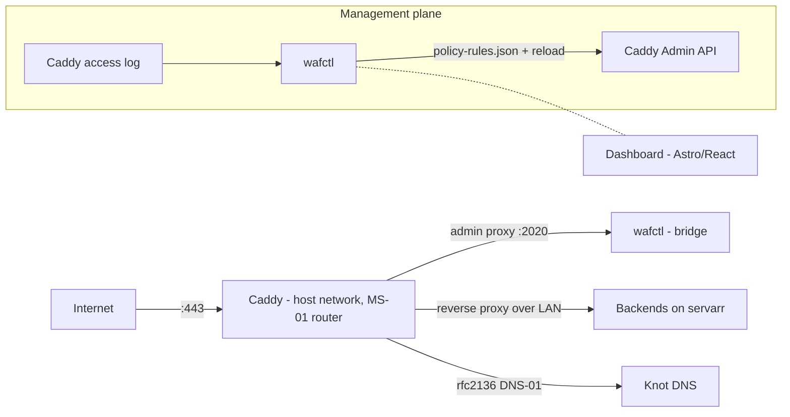

# caddy-compose

Docker Compose stack for the edge Caddy reverse proxy (host-mode on the MS-01 NixOS router) with custom Go plugins (policy engine WAF, DDoS mitigation, L4 proxying) and a management sidecar (wafctl) + dashboard. Deployed via Composer as the `edge-services` stack; backends live on servarr over the LAN.

> **2026-08-09 direction change:** the CRS/WAF/challenge stack is slated for removal and wafctl will be renamed **edgectl** (edge control plane: ddos/jail/events now, host-config management via the Caddy admin API next). See PLAN.md "Direction Change". Authelia was retired 2026-07 - there is no IdP in the stack.

## Architecture


```mermaid
graph LR
    Internet -->|:443| Caddy[Caddy - host network, MS-01 router]
    Caddy -->|admin proxy :2020| wafctl[wafctl - bridge]
    Caddy -->|reverse proxy over LAN| Backends[Backends on servarr]
    Caddy -->|rfc2136 DNS-01| Knot[Knot DNS]

    subgraph Management plane
        AccessLog[Caddy access log] --> wafctl2[wafctl]
        wafctl2 -->|policy-rules.json + reload| CaddyAdmin[Caddy Admin API]
    end

    wafctl2 -.- Dashboard[Dashboard - Astro/React]
```

Two containers:

- **Caddy** uses `network_mode: host` on the MS-01 router and binds ports 80 and 443 (admin API on localhost:2019 only). It reaches backends over the LAN (servarr `10.0.71.x`) and local bridge networks (`172.31.x`, `172.40.x`).
- **wafctl** (being renamed **edgectl**) sits on its own bridge network. It reads Caddy access logs, generates policy engine rules, and reaches Caddy through an IP-restricted admin proxy on `:2020`. The dashboard (Astro + React + shadcn/ui) is bundled into the wafctl image and served by it.

Authelia was retired 2026-07. Private API surfaces use the bearer-or-LAN `(research_auth)` snippet instead of forward auth. ACME uses rfc2136 DNS-01 against the self-hosted Knot DNS (TSIG); one zone (`erfianugrah.com`) is still on Cloudflare.

## Quick start

### Prerequisites

- Docker and Docker Compose
- A domain served by the self-hosted Knot DNS (ACME via rfc2136/TSIG), or Cloudflare DNS for legacy zones
- The TSIG key for the rfc2136 issuer (or a Cloudflare API token with Zone:DNS:Edit for legacy zones)

### 1. Clone and configure

```bash
git clone https://github.com/<your-org>/caddy-compose.git
cd caddy-compose
```

Create a `.env` file (SOPS-encrypted in production — see [Secrets](#secrets) below):

```bash
cat > .env <<'EOF'
TSIG_CADDY_ACME=<tsig-key-for-rfc2136-issuer>
EMAIL=<your-email-for-acme>
# CF_API_TOKEN=<cloudflare-token>  # legacy zones only (erfianugrah.com)
EOF
```

### 2. Customize the Caddyfile

The LIVE config is `deploy/edge/Caddyfile` - the repo-root `Caddyfile` is the legacy servarr config, never edit it for prod changes. Site blocks use the snippet idiom: `import waf` (or `waf_off`), `import tls_config_rfc2136`, `import proxy_headers`, `import error_pages`, `import site_log <name>`. To add a service:

1. Add a site block pointing `reverse_proxy` at the backend (LAN IP on servarr or a local bridge IP).
2. Add the DNS record via knotctl.
3. `make caddy-reload` (syncs from git + redeploys WAF/CSP/headers + reloads).

The 2026-08-09 direction change (PLAN.md) moves host lifecycle into edgectl via the Caddy admin API; the Caddyfile remains the static skeleton.

### 3. Update image references

The Makefile, compose.yaml, and CI workflow all reference Docker Hub image names. Search for the current values and replace them with your own registry path:

```bash
# In Makefile (lines 14-15)
CADDY_IMAGE   ?= <your-registry>/caddy:3.97.1-2.11.4
WAFCTL_IMAGE  ?= <your-registry>/wafctl:2.101.3

# In compose.yaml — the image fields for caddy and wafctl services
# In .github/workflows/build.yml — the env block
```

### 4. Build and deploy

```bash
make build     # builds both images locally
make push      # pushes to your registry
make deploy    # build + scan + push + sync + restart via Composer
```

Or step by step:

```bash
make build-caddy       # caddy image only
make build-wafctl      # wafctl image only
make sync              # sync stack from git via Composer API
make restart            # redeploy via Composer (handles SOPS .env decryption)
```

See `make help` for all available targets.

### 5. Verify

```bash
make status   # container health on the remote host
make logs     # tail logs
curl -s https://your-waf-subdomain.example.com/api/health | jq .
```

## Configuration

### Makefile variables

Override any of these in a `.env.mk` file (gitignored) or inline:

```bash
make deploy REMOTE=myhost
```

| Variable | Default | Description |
|---|---|---|
| `REMOTE` | (see Makefile) | SSH host alias or `user@host` for the target machine |
| `COMPOSER_API_KEY` | (env) | Composer API key for authenticated requests (required) |
| `COMPOSER_CONTAINER` | `composer` | Container name running Composer on the remote host |
| `COMPOSER_STACK` | `caddy` | Stack name in Composer |
| `CADDY_IMAGE` | see Makefile | Full image:tag for the Caddy image |
| `WAFCTL_IMAGE` | see Makefile | Full image:tag for the wafctl image |
| `STACK_PATH` | `/opt/stacks/caddy/compose.yaml` | Path to the compose file inside the Composer container |

### Secrets

The `.env` file and `authelia/users_database.yml` are SOPS-encrypted with age. A pre-commit hook blocks commits containing unencrypted secrets by checking for SOPS `ENC[AES256_GCM,...]` markers. You can bypass this per-file with `.allow-unencrypted-paths` or globally with `.allow-unencrypted`.

### Version management

Image tags must stay in sync across five files:

- `Makefile` (lines 17-18: `CADDY_IMAGE`, `WAFCTL_IMAGE`)
- `compose.yaml` (lines 3 and 119: image fields)
- `.github/workflows/build.yml` (env block: `CADDY_TAG`, `CADDY_VERSION`, `WAFCTL_VERSION`)
- `deploy/edge/compose.yaml` (line 22: image field, edge variant)
- `README.md` (this file, examples and references)

Tag format: Caddy is `<project-version>-<caddy-version>` (e.g. `3.78.0-2.11.2`), wafctl is plain semver (e.g. `2.82.0`).

The `CADDY_VERSION` env in `build.yml` and `ARG VERSION` in `Dockerfile` are the **Caddy upstream** version (the `caddy:X.Y.Z-builder` base image). The `CADDY_TAG` is what we publish to Docker Hub and reference in `compose.yaml`. The two trail each other — bumping Caddy upstream usually bumps both, but not always (project-version bumps can ship without an upstream Caddy bump).

#### Bumping Caddy upstream

When you bump `ARG VERSION` in the `Dockerfile`, update the same value in the list below plus `deploy/edge/compose.yaml`'s `image:` field:
- `.github/workflows/build.yml` — `CADDY_VERSION` env
- `.github/workflows/build.yml` — `CADDY_TAG` env (trailing portion of the tag)
- `Makefile` — `CADDY_IMAGE` (trailing portion)
- `compose.yaml` — `image:` field for the `caddy` service
- `README.md` — any inline examples that mention the tag

The minimum acceptable Caddy version is determined by the **union of all `--with` module requirements** — each xcaddy module's `go.mod` declares its `caddy/v2` minimum, and Go module resolution takes the highest. If a module bump raises the minimum above `ARG VERSION`, the build fails with `requires github.com/caddyserver/caddy/v2@vX.Y.Z, not vX.Y.W` and you must bump `ARG VERSION`.

### Caddy modules (xcaddy `--with`)

The `Dockerfile`'s `RUN xcaddy build` line composes all the Caddy plugins into the binary. There are currently ten `--with` plugins (see the inline comments in `Dockerfile` for what each one does), including the edge HTTP cache pair (`caddyserver/cache-handler` + `darkweak/storages/nuts`).

Two of the build lines are not plain versioned plugins:

- **Souin fork** - `--with github.com/darkweak/souin=github.com/erfianugrah/souin@v1.7.7-erfi.1`. The cache core is our fork (branched off upstream v1.7.7) carrying two patches for bugs the local harness (`test/cache/`) reproduced upstream: (1) `Store()` subtracted the full upstream fetch latency from the fresh TTL, so slow origins were stored born-stale; (2) a successful stale-if-error `Revalidate()` fell through to a second `Upstream()` fetch and stored the doubled body. Details + evidence in `test/cache/README.md` quirks #6/#7.
- **grpc replace** - `--replace google.golang.org/grpc=google.golang.org/grpc@v1.82.1`. Forces the transitive gRPC dep (pulled in indirectly by `caddy-l4`) off v1.81.0, which has a HIGH vuln (GHSA-hrxh-6v49-42gf) fixed in v1.82.1. `--replace` (not `--with`) is the xcaddy lever for non-plugin deps: it writes a `go.mod` replace directive without a blank import. Drop it once a pinned module requires >= v1.82.1.

#### Pin discipline

All `--with` lines are pinned since 2026-07-25 (`caddy-dynamicdns` has no tags, so it's pinned by commit `@a5890c9`). With the base now on 2.11.4, `caddy-l4` is pinned at `v0.1.2` (the release that requires 2.11.4). Unpinned modules floated to whatever was latest on `master` at build time. This has bitten us — e.g. `caddy-l4 v0.1.1` (2025-04-24) raised its `caddy/v2` minimum to `2.11.3` and broke our `2.11.2` builds with `make build NO_CACHE=1` until we bumped Caddy. It happened again on 2026-07-25: `caddy-l4 v0.1.2` raised the minimum to `2.11.4`, breaking 2.11.3 builds - after which both previously-unpinned modules were pinned.

Pin everything (done for all modules since 2026-07-25):

```diff
- --with github.com/mholt/caddy-l4 \
+ --with github.com/mholt/caddy-l4@v0.1.2 \
```

The trade-off: pinned modules don't pick up upstream security fixes on rebuild, so pins need deliberate bumps. For modules we rely on heavily (`caddy-policy-engine` etc.), pinned with manual bumps is right. For peripheral modules, floating to latest trades reproducibility for freshness — but expect occasional rebuild surprises.

#### Adding a new module

1. Look up the module's latest stable tag (Go modules tend to use `vX.Y.Z` on GitHub).
2. Verify its `go.mod` declares a `caddy/v2` requirement compatible with the current `ARG VERSION` in `Dockerfile`:
   ```bash
   curl -s https://raw.githubusercontent.com/<owner>/<repo>/<tag>/go.mod | grep caddy/v2
   ```
3. Add the `--with` line to `Dockerfile` (pinned).
4. Build to confirm xcaddy resolves cleanly:
   ```bash
   docker build --no-cache --target builder -t caddy-test:dev .
   ```
5. Verify the module actually registered in the binary:
   ```bash
   docker run --rm caddy-test:dev /usr/bin/caddy list-modules | grep <expected-module-id>
   ```
   Module IDs are usually `<namespace>.providers.<name>` (DNS providers), `http.handlers.<name>` (HTTP middleware), or `layer4.<name>` (L4). The module repo's README usually documents the registered ID.
6. If the build fails with `requires github.com/caddyserver/caddy/v2@vX.Y.Z`, the new module needs a Caddy version newer than what `ARG VERSION` allows — either bump `ARG VERSION` (see *Bumping Caddy upstream* above) or pick an older module version.

#### Verifying a deployed build

After `make deploy-caddy`, confirm the module loaded on the live container:

```bash
ssh router 'docker exec caddy /usr/bin/caddy list-modules | grep <module-id>'
```

For DNS providers specifically, also verify the Caddyfile actually consumes the new provider (otherwise the module is loaded but inert):

```bash
make logs-caddy | grep -i 'acme.*<provider-name>\|dns.*<provider-name>'
```

## Edge HTTP cache

REMOVED from the running config 2026-08-07 (commit 02b0706). The souin fork (`github.com/erfianugrah/souin@v1.7.7-erfi.1`) + nuts storage modules are still compiled into the Caddy image, but no `cache` handler is configured in `deploy/edge/Caddyfile` - and the `stale-if-error` origin-down insurance for docs/jellyfin/navidrome went with it.

The full quirk list is preserved in `test/cache/README.md` - read it before re-enabling: the broken souin admin purge API, SWR broken by souin#699, the per-site nuts storage requirements from the 2026-07-31 incident (unique `Dir` inside `configuration`, never a global nuts block), and the two fork patches. The local harness still runs: `make test-cache`. Note `tools/cachectl verify` asserts a global cache block that no longer exists - fix or retire it when the cache question is decided.

## WAF configuration

> Slated for removal per the 2026-08-09 direction change (PLAN.md "Direction Change"). This section documents the system as-built and is the reference for what the removal must unwind. The DDoS mitigator and L4 proxying are NOT being removed.

All WAF settings are managed through the dashboard or wafctl CLI.

A custom [caddy-policy-engine](https://github.com/erfianugrah/caddy-policy-engine) plugin evaluates allow/block/honeypot/detect rules and handles rate limiting. The plugin uses hash-set lookups for `in` operator matching. Rules are hot-reloaded from `policy-rules.json` without Caddy restarts.

A custom [caddy-body-matcher](https://github.com/erfianugrah/caddy-body-matcher) plugin provides request body matching (raw, JSON, form) and a `body_vars` handler that extracts body field values as Caddy placeholders. This enables body-aware rate limiting (e.g., rate limit by a JSON API key field) and body-based WAF conditions.

### WAF modes

| Mode | Effect |
|------|--------|
| `enabled` | Full blocking. Requests exceeding anomaly thresholds get 403. |
| `detection_only` | Log only. Rules evaluate and log but never block. Thresholds forced to 10000. |
| `disabled` | No WAF processing. |

Per-service overrides let you run individual services in a different mode than the global default.

### Config persistence

Dynamic config survives container restarts. wafctl stores state in JSON files on a Docker volume and regenerates `policy-rules.json` on boot (`generateOnBoot`). The policy engine plugin detects mtime changes and hot-reloads rules automatically.

### Reload fingerprint

When only included `.conf` files change (not the Caddyfile itself), Caddy's `/load` endpoint may skip reprovisioning. wafctl works around this by injecting a SHA-256 fingerprint comment into the Caddyfile before POSTing to `/load`. The on-disk Caddyfile is never modified.

### Challenge (PoW) protection

Challenge rules serve a proof-of-work interstitial (SHA-256 hashcash) that clients must solve before reaching the upstream. The interstitial runs in Web Workers for parallelism, with a pure-JS SHA-256 fallback for non-secure contexts. On success, an HMAC-signed cookie bypasses the challenge on subsequent requests.

**Bot scoring** runs during the PoW computation window — 6 layers: JA4 TLS fingerprint, HTTP headers, 13 JS environment probes, behavioral signals (mouse/keyboard/scroll/focus/worker-timing-variance), spatial inconsistency, and timing validation. Score >= 70 rejects even with a valid PoW.

**Challenge rule fields:**

| Field | Default | Description |
|-------|---------|-------------|
| `challenge_difficulty` | 4 | Static difficulty (1-16). SHA-256 leading hex zeros. 4 ≈ 0.5s, 6 ≈ 5s, 8 ≈ 30s. **Ignored when adaptive range is active.** |
| `challenge_min_difficulty` | 0 (disabled) | Adaptive minimum (1-16). Easiest puzzle for clean browsers (good JA4, proper headers). Set both min and max to enable adaptive mode. |
| `challenge_max_difficulty` | 0 (disabled) | Adaptive maximum (1-16). Hardest puzzle for suspicious clients (no ALPN, missing Sec-Fetch). Server picks per-request via `preSignalScore()`. |
| `challenge_algorithm` | "fast" | "fast" = native WebCrypto speed. "slow" = 10ms delay per hash iteration, penalizes all clients equally. **Orthogonal to difficulty** — does not interact with adaptive range. Caution: slow + difficulty > 2 causes multi-minute solves for real users. |
| `challenge_ttl` | "1h" | Cookie lifetime before re-challenge. Accepts extended durations: "1h", "4h", "24h", "7d". |
| `challenge_bind_ip` | true | Invalidates cookie if client IP changes. Disable for mobile users on cellular networks. |
| `challenge_bind_ja4` | true | Invalidates cookie if JA4 TLS fingerprint changes. Prevents cookie replay from a different TLS stack (e.g., solve in browser, replay from curl). |

**How difficulty selection works:**
- If `challenge_min_difficulty` and `challenge_max_difficulty` are both 0 → static mode: all clients get `challenge_difficulty`.
- If both are > 0 → adaptive mode: the server runs `preSignalScore(request)` using JA4/TLS (L1), HTTP headers (L2), and UA spatial checks (partial L5). Score 0 → min difficulty, score >= 70 → max difficulty, proportional in between. `challenge_difficulty` is ignored.
- If only one is set, the other defaults to `challenge_difficulty`.

**Timing validation** (automatic, no configuration needed): the server computes a minimum expected solve time from the difficulty and the client's reported `navigator.hardwareConcurrency`. Solutions faster than floor/3 are hard-rejected (physically impossible). Solutions faster than floor get a +40 bot score penalty.

**Expected solve times** (median, assuming parallel Web Workers):

| Difficulty | Fast (8 cores) | Slow (8 cores) | Slow (1 core) |
|:---:|---:|---:|---:|
| 1 | instant | ~10ms | ~80ms |
| 2 | instant | ~160ms | ~1.3s |
| 3 | instant | ~2.6s | ~20s |
| 4 | ~0.04ms | ~41s | ~5.5 min |
| 5 | ~0.7ms | ~10.9 min | ~1.5 hours |
| 6 | ~10ms | ~2.9 hours | ~23.3 hours |
| 7 | ~168ms | ~1.9 days | ~15.5 days |
| 8 | ~2.7s | ~31 days | ~248 days |

Fast mode uses native WebCrypto (~2μs/hash). Slow mode adds a 10ms `setTimeout` per iteration, making it orthogonal to difficulty — the hash space is the same, each iteration just takes longer. **Slow + difficulty > 2 is effectively unsolvable** for most clients.

**Challenge analytics** dashboard at `/challenge`: funnel (issued/passed/failed/bypassed with rates), bot score distribution histogram, hourly timeline, per-algorithm breakdown (fast vs slow with avg solve time and avg difficulty), expected solve time reference table, top challenged clients (with unique token counts and avg/max bot scores), top challenged services (with fail rates), top JA4 fingerprints. Supports `service` and `client` filters. API: `GET /api/challenge/stats?hours=24&service=x&client=y`.

**Per-event enrichment**: security events show the algorithm, difficulty, actual solve time, and expected solve time (with 8-core estimate) for comparison. Events that solved faster than expected are flagged.

## WAF dashboard

The dashboard is an Astro 7 + React 19 static site bundled in the wafctl image and served by wafctl, bearer-gated at the edge.

**Pages:**

- **Overview** — timeline chart with brush zoom (7 event types, unstacked), service breakdown donut, live event feed, top clients/services, stat cards linking to filtered views. Includes a CF-style filter bar with field/operator/value popover and filter chips.
- **Events** — paginated table of WAF + rate limit + IPsum events. Expandable rows with matched rules, request headers/body/args. JSON export. "Create Exception" button pre-fills a policy engine rule from the event context.
- **Policy Engine** — CRUD for WAF exclusions (allow, block, skip, raw SecRule, and various CRS removal types). Condition builder with AND/OR logic. Tag-based classification. CRS rule catalog picker. Sparkline hit charts per rule.
- **Rate Limits** — condition-based rate limiting policy engine with per-path/method/header matching, flexible rate keys, auto-deploy, sparkline hit charts, import/export. Includes a **Rate Advisor** tab with statistical anomaly detection (MAD, Fano factor, IQR) that analyzes real traffic patterns and recommends rules with one-click creation. Global settings panel for jitter, sweep interval, and distributed rate limiting.
- **Managed Lists** — reusable named lists (IPs, paths, user agents, etc.) referenced by WAF and rate limit conditions via `in_list`/`not_in_list` operators. Full CRUD with search, inline editing, import/export. Includes IPsum blocklist stats, per-IP lookup, and on-demand refresh.
- **CSP** — per-service Content Security Policy management with directive editor, source input, live preview, set/default/none modes, report-only, global enable/disable.
- **Logs** — general Caddy log viewer with stream tab, summary aggregation, and header compliance analysis.
- **Services** — per-service stats, top URIs, top triggered rules.
- **Challenge Analytics** — PoW challenge funnel (issued/passed/failed/bypassed), bot score distribution histogram, hourly timeline, top challenged clients with unique token counts and bot score averages, top challenged services with fail rates, top JA4 TLS fingerprints. Service and client filters with click-to-filter tables.
- **Sessions** — session behavioral tracking dashboard. Per-session signal analysis (mouse, scroll, keystroke, focus, navigation timing), bot score breakdown, session alerts, JTI denylist management. Configurable scoring weights and auto-escalation thresholds.
- **Investigate** — top blocked IPs, top URIs, top countries, IP lookup with GeoIP resolution.
- **Settings** — global and per-service WAF settings including full CRS v4 coverage (paranoia levels, anomaly thresholds, mode, allowed methods, content types, argument limits, file limits, blocked extensions, HTTP versions, restricted headers, CRS exclusion profiles). All fields have tooltips explaining their purpose. Deploy button with step-by-step progress.

Cross-page navigation ties everything together: clicking a stat card on Overview drills into Events, clicking an IP goes to Investigate, "Create Exception" from Events pre-fills the Policy Engine, and policy sparklines link back to Overview.

## wafctl

wafctl is both an HTTP API server and a CLI tool (being renamed **edgectl** - see PLAN.md "Direction Change"). When run without arguments (or with `serve`), it starts the API server. Otherwise it acts as a thin client that talks to a running instance.

It manages WAF configuration (including full CRS v4 settings), the WAF policy engine (exclusions with condition-based matching and tag-based classification), managed lists (reusable value sets for conditions), condition-based rate limiting with a traffic advisor, IPsum blocklist operations, and GeoIP resolution with a three-tier lookup (Cloudflare header → local MMDB → online API).

### CLI usage

```
wafctl                  # start API server (default)
wafctl serve            # same as above
wafctl version          # print version
wafctl health           # check server health

wafctl config get       # show WAF configuration
wafctl config set       # update config (JSON on stdin or --file)

wafctl rules list       # list policy exclusion rules
wafctl rules get <id>   # get a rule by ID
wafctl rules create     # create rule (JSON on stdin or --file)
wafctl rules delete <id>

wafctl deploy           # deploy WAF config to Caddy
wafctl events           # list events (--hours, --limit, --service, --type, etc.)

wafctl ratelimit list       # list all rate limit rules (alias: rl)
wafctl ratelimit get <id>   # get a rate limit rule by ID
wafctl ratelimit create     # create rule (JSON on stdin or --file)
wafctl ratelimit delete <id>
wafctl ratelimit deploy     # deploy rate limit configs to Caddy
wafctl ratelimit global     # show global rate limit settings

wafctl csp get              # show CSP configuration
wafctl csp set              # update config (JSON on stdin or --file)
wafctl csp deploy           # deploy CSP configs to Caddy
wafctl csp preview          # preview rendered CSP headers per service

wafctl lists list           # list all managed lists (alias: ls)
wafctl lists get <id>       # get a managed list by ID
wafctl lists create         # create list (JSON on stdin or --file)
wafctl lists delete <id>

wafctl blocklist stats
wafctl blocklist check <ip>
wafctl blocklist refresh
```

Flags: `--addr` (API address, default from `WAFCTL_ADDR` env), `--json` (raw JSON output), `--file`/`-f` (read input from file).

### API endpoints

| Group | Routes |
|-------|--------|
| Core | `GET /api/health`, `GET /api/summary`, `GET /api/events`, `GET /api/services` |
| Analytics | `GET /api/analytics/top-ips`, `GET /api/analytics/top-uris`, `GET /api/analytics/top-countries`, `GET /api/analytics/cf` |
| IP Lookup | `GET /api/lookup/{ip}` |
| Rules | `GET\|POST /api/rules`, `GET\|PUT\|DELETE /api/rules/{id}` (canonical; `/api/exclusions` kept as alias) |
| Rule ops | `GET /api/rules/export`, `POST /api/rules/import`, `POST /api/rules/generate`, `GET /api/rules/hits`, `PUT /api/rules/reorder` |
| Rule templates | `GET /api/rules/templates`, `POST /api/rules/templates/{id}/apply` |
| CRS | `GET /api/crs/rules` |
| Config | `GET\|PUT /api/config`, `POST /api/config/generate`, `POST /api/config/validate`, `POST /api/config/deploy` |
| Rate limits | `GET\|POST /api/rate-limit/rules`, `GET\|PUT\|DELETE /api/rate-limit/rules/{id}`, `POST /api/rate-limit/deploy`, `GET\|PUT /api/rate-limit/global` |
| RL analytics | `GET /api/rate-limit/summary`, `GET /api/rate-limit/events`, `GET /api/rate-limit/advisor` |
| Challenge | `GET /api/challenge/stats`, `GET /api/challenge/reputation` |
| DDoS | `GET /api/dos/status`, `GET /api/dos/jail`, `GET\|PUT /api/dos/config`, `GET /api/dos/reports`, `GET /api/dos/profiles` |
| Managed Lists | `GET\|POST /api/lists`, `GET\|PUT\|DELETE /api/lists/{id}` |
| CSP | `GET\|PUT /api/csp`, `POST /api/csp/deploy`, `GET /api/csp/preview`, `GET /api/csp/violations` |
| Security headers | `GET\|PUT /api/security-headers`, `POST /api/security-headers/deploy` |
| Discovery | `GET /api/discovery/endpoints` |
| General Logs | `GET /api/logs`, `GET /api/logs/summary` |
| CF Proxy | `GET /api/cfproxy/stats`, `POST /api/cfproxy/refresh` |
| Blocklist | `GET /api/blocklist/stats`, `GET /api/blocklist/check/{ip}`, `POST /api/blocklist/refresh` |
| Backup | `GET /api/backup`, `POST /api/backup/restore` |
| DNS | `GET\|PUT /api/dns`, `POST /api/dns/test` |
| Ops | `GET /api/upstreams/{service}`, `GET /api/upgrade/status`, `POST /api/upgrade/run` |

~90 endpoints total (plus blocked-hostnames, ports, and the UI catch-all). The Sessions endpoints are retired (store remains, routes not registered). The CLI (`wafctl <group>`) is the stable surface; this table drifts - `wafctl --help` wins.

### Environment variables

All configurable via `envOr()` with sensible defaults:

| Variable | Default | Description |
|---|---|---|
| `WAFCTL_PORT` | `8080` | API server port |
| `WAF_CORS_ORIGINS` | `*` | Allowed CORS origins |
| `WAF_AUDIT_LOG` | — | Path to audit log (legacy, unused) |
| `WAF_COMBINED_ACCESS_LOG` | — | Path to Caddy combined access log |
| `WAF_EXCLUSIONS_FILE` | — | Path to exclusions JSON store |
| `WAF_CONFIG_FILE` | — | Path to WAF config JSON store |
| `WAF_RATELIMIT_FILE` | — | Path to rate limit JSON store |
| `WAF_CADDY_ADMIN_URL` | `http://caddy:2019` | Caddy admin API endpoint |
| `WAF_EVENT_FILE` | `/data/events.jsonl` | JSONL persistence for WAF events |
| `WAF_ACCESS_EVENT_FILE` | `/data/access-events.jsonl` | JSONL persistence for access log events |
| `WAF_EVENT_MAX_AGE` | `2160h` (90 days) | Event retention period |
| `WAF_TAIL_INTERVAL` | `5s` | Log tail polling interval |
| `WAF_GEOIP_DB` | `/data/geoip/country.mmdb` | Path to MMDB file for GeoIP lookups |
| `WAF_GEOIP_API_URL` | (disabled) | Online GeoIP API URL (e.g. `https://ipinfo.io/%s/json`) |
| `WAF_GEOIP_API_KEY` | (empty) | Bearer token for online GeoIP API |
| `WAF_AUDIT_OFFSET_FILE` | `/data/.audit-log-offset` | Persists audit log read offset (legacy) |
| `WAF_ACCESS_OFFSET_FILE` | `/data/.access-log-offset` | Persists access log read offset across restarts |
| `WAF_CADDYFILE_PATH` | `/data/Caddyfile` | Path to Caddyfile for service FQDN resolution |
| `WAF_CSP_FILE` | `/data/csp-config.json` | CSP configuration store path |
| `WAF_GENERAL_LOG_FILE` | `/data/general-events.jsonl` | JSONL persistence for general log events |
| `WAF_GENERAL_LOG_OFFSET_FILE` | `/data/.general-log-offset` | Persists general log read offset across restarts |
| `WAF_GENERAL_LOG_MAX_AGE` | `168h` (7 days) | Retention period for general log events |
| `WAF_BLOCKLIST_REFRESH_HOUR` | `6` | UTC hour (0–23) for daily IPsum blocklist refresh |
| `WAF_MANAGED_LISTS_FILE` | `/data/lists.json` | Managed lists store path |
| `WAF_MANAGED_LISTS_DIR` | `/data/lists` | Output dir for managed list files |
| `WAF_SESSION_FILE` | `/data/sessions.json` | Session behavioral tracking data store path |
| `WAF_SESSION_CONFIG_FILE` | `/data/session-config.json` | Session scoring configuration store path |
| `WAF_POLICY_RULES_FILE` | `/data/waf/policy-rules.json` | Policy engine rules JSON output path |

## Event store sizing

wafctl maintains three event stores in JSONL format. Sizing depends on traffic
volume and retention period.

### Stores

| Store | File | Default Retention | Contents |
|-------|------|-------------------|----------|
| WAF events | `events.jsonl` | 90 days (`WAF_EVENT_MAX_AGE`) | CRS detect/block events |
| Access log events | `access-events.jsonl` | 90 days (`WAF_EVENT_MAX_AGE`) | Policy blocks, rate limits, detects, skips |
| General log events | `general-events.jsonl` | 7 days (`WAF_GENERAL_LOG_MAX_AGE`) | All access log entries (high volume) |

### Disk usage estimates

| Traffic level | Events/day | 90-day WAF+Access store | 7-day General store |
|---------------|-----------|------------------------|---------------------|
| Low (100 req/hr) | ~50 events | ~5 MB | ~50 MB |
| Medium (1K req/hr) | ~500 events | ~50 MB | ~500 MB |
| High (10K req/hr) | ~5,000 events | ~500 MB | ~5 GB |
| Very high (100K req/hr) | ~50,000 events | ~5 GB | ~50 GB |

Events are ~1 KB each (JSON with headers, matched rules, tags).
General log entries are ~500 bytes each (request metadata only).

### Tuning

- **Reduce retention**: Set `WAF_EVENT_MAX_AGE=720h` (30 days) or `168h` (7 days)
- **Reduce general log retention**: `WAF_GENERAL_LOG_MAX_AGE=24h` (1 day)
- **Disable general logging**: Don't set `WAF_GENERAL_LOG_FILE`
- **Monitor disk usage**: Check `/data/events/` directory size periodically
- **Eviction is automatic**: Events older than max age are pruned on each tail cycle

### Memory usage

Events are held in memory for fast querying. Incremental summary counters
(per-hour buckets) reduce memory pressure from full scans. Approximate memory:

- 10K events in memory: ~15 MB
- 100K events in memory: ~150 MB
- 1M events in memory: ~1.5 GB

For high-traffic deployments, reduce `WAF_EVENT_MAX_AGE` to keep memory bounded.

## Site block patterns

Since Caddy runs with `network_mode: host` on the MS-01, it reaches backends over the LAN (servarr `10.0.71.x`, incl. host-published ports on `10.0.71.2`) or via local bridge IPs (`172.31.x`, `172.40.x`). Every site block imports a standard set of snippets. Three patterns cover most use cases:

### Pattern A: no authentication

For public services or services with their own auth:

```
myservice.erfi.io {
    import waf
    import tls_config_rfc2136
    encode zstd gzip
    reverse_proxy <backend-ip>:<port> {
        import proxy_headers
    }
    import error_pages
    import site_log myservice
}
```

### Pattern B: bearer-or-LAN gate

For private API surfaces (the post-Authelia auth pattern): LAN + tailnet pass open, WAN needs `Authorization: Bearer $RESEARCH_TOKEN`:

```
myservice.erfi.io {
    import waf
    import research_auth
    import tls_config_rfc2136
    encode zstd gzip
    reverse_proxy <backend-ip>:<port> {
        import proxy_headers
    }
    import error_pages
    import site_log myservice
}
```

### Pattern C: mixed (some paths bypass the gate)

Use `route` to control evaluation order - first match wins:

```
myservice.erfi.io {
    import waf
    import tls_config_rfc2136
    encode zstd gzip

    route {
        @public path /api/* /webhooks/*
        reverse_proxy @public <backend-ip>:<port> {
            import proxy_headers
        }

        reverse_proxy <backend-ip>:<port> {
            import proxy_headers
        }
    }
    import error_pages
    import site_log myservice
}
```

### Required snippets

Every site block should include these, in order:

| Snippet | Required | Purpose |
|---------|----------|---------|
| `import waf` or `import waf_off` | yes (until the WAF removal lands) | Policy engine + ddos guard; `waf_off` is the empty placeholder |
| `import research_auth` | for private API surfaces | Bearer-or-LAN gate (post-Authelia) |
| `import tls_config_rfc2136` | yes | ACME DNS-01 via TSIG to Knot DNS |
| `import tls_config` | CF-DNS zones only | ACME via Cloudflare (legacy; `erfianugrah.com` only) |
| `encode zstd gzip` | recommended | Response compression |
| `import proxy_headers` | yes (inside `reverse_proxy`) | Trusted proxy headers for real client IP |
| `import error_pages` | yes | Custom error page templates |
| `import site_log <name>` | yes | JSON access log + combined log for analytics |

> **Note:** CORS, security headers, and static asset caching are no longer configured via Caddyfile snippets. They are now managed through the wafctl API and rule templates:
> - **CORS** — configured per-service via `/api/cors` (plugin-level CORS handling)
> - **Security headers** — managed via `/api/security-headers` (HSTS, CSP, nosniff, etc.)
> - **Static asset caching** — use the `cache-static-assets` rule template to add Cache-Control headers

Rate limit rules are managed by wafctl. Rate limiting is handled by the policy engine plugin via `policy-rules.json` hot-reload — no Caddy restart needed. Rules support condition-based matching (per-path, per-method, per-header), flexible rate keys (client IP, path, header values), and auto-deploy on save.

## Security hardening

### Container security

| Feature | Caddy | wafctl |
|---------|-------|--------|
| `read_only: true` | yes | yes |
| `cap_drop: ALL` | yes | yes |
| `cap_add` | `NET_BIND_SERVICE`, `DAC_OVERRIDE` | none |
| `no-new-privileges` | yes | yes |
| `user` | root (needs port 443) | `65534` (nobody) |
| Healthcheck | yes | yes |
| Resource limits | 8 CPU / 2048M | 0.5 CPU / 128M |

### Additional layers

- **IPsum blocklist** — ~200k+ known-malicious IPs (all 8 IPsum threat levels, min_score=1), managed as 8 per-level managed lists evaluated by the policy engine plugin, updated daily at 06:00 UTC by wafctl, refreshable on demand from the dashboard.
- **Cloudflare trusted proxies** — IP ranges fetched at build time so Caddy resolves the real client IP from `X-Forwarded-For`.
- **Security headers** — HSTS (2yr, preload), nosniff, SAMEORIGIN, strict referrer, permissions-policy, COOP, CORP. Per-service CSP headers managed via wafctl CSP system (global defaults + per-service overrides with set/default/none modes, report-only, and global enable/disable).
- **ECH** (Encrypted Client Hello) — hides SNI from network observers.
- **Admin API** locked to localhost.
- **Strict SNI** host checking.

### Image supply chain

The CI pipeline (GitHub Actions) includes:
- **Trivy** vulnerability scanning (CRITICAL + HIGH gate)
- **Cosign** keyless image signing via Sigstore/Fulcio OIDC
- **Syft** SBOM generation (SPDX + CycloneDX) attached as cosign attestations

## Security

caddy 3.52.0 / wafctl 2.56.0 — CRS converter accuracy improvements (+33 rules), per-rule log_only action, dynamic CRS catalog.

caddy 3.49.1 / wafctl 2.53.1 includes a comprehensive security audit (March 2026):
- **wafctl**: Bearer token auth (WAF_AUTH_TOKEN), DDoS config validation, jail IP validation, SSRF DNS rebinding protection, header CRLF validation, validate-before-apply backup restore
- **Dashboard**: DDoS event classification and detail panel, DETECT BLOCK/DDOS BLOCKED badges, timeline with DDoS data, CIDR whitelist pills UI, streaming JSON export, indexed event queries
- **Error pages**: Distinct 403 (shield icon + ref ID), 429 with Retry-After countdown, per-status gradients
- **Cross-repo**: All 123 security audit findings addressed across caddy-body-matcher, caddy-policy-engine, caddy-ddos-mitigator, and caddy-compose

## Testing

```bash
make test              # all tests (Go + frontend)
make test-go           # Go tests only (~626 tests across 31 files)
make test-frontend     # Vitest frontend tests (~384 tests across 19 files)
make test-e2e          # Docker-based e2e smoke tests (~119 tests across 20 files)
make test-cache        # edge HTTP cache harness (extracts binary from CADDY_IMAGE)
```

Run a single test:

```bash
# Go
cd wafctl && go test -run TestFunctionName -count=1 -timeout 60s ./...

# Frontend
cd waf-dashboard && npx vitest run -t "test description"
```

## File structure

```
caddy-compose/
  Caddyfile              # Caddy config (snippets + site blocks)
  Dockerfile             # 4-stage multi-stage build (caddy-body-matcher + caddy-policy-engine + caddy-ddos-mitigator plugins)
  Makefile               # Build, push, deploy, test, WAF operations
  compose.yaml           # Legacy servarr-era stack file; the LIVE deploy is deploy/edge/
  .env                   # SOPS-encrypted secrets (TSIG keys, email)
  deploy/
    edge/
      Caddyfile          # LIVE edge config (MS-01 router)
      compose.yaml       # edge-services stack (Caddy host-mode + wafctl bridge)
      authelia/          # Retired 2026-07 - historical
  errors/
    error.html           # Custom error page template
  scripts/
    entrypoint.sh        # Container entrypoint (seeds CF proxies + caddy run)
    setup-cors.sh        # CORS setup helper
    update-geoip.sh      # GeoIP database updater (manual)
  wafctl/                # Go sidecar (zero external dependencies)
    main.go              # Server setup, CORS middleware, route registration
    cli.go               # CLI framework, serve/config/deploy commands
    cli_rules.go         # CLI rules/exclusions subcommands
    cli_extras.go        # CLI ratelimit/csp/blocklist/events subcommands
    models.go            # Core data models (CRS scoring, audit log, summary types)
    models_exclusions.go # Condition, RuleExclusion, WAFConfig types
    models_ratelimit.go  # Rate limit types
    models_general_logs.go # General log types
    config.go            # WAF config store (CRS v4 extended settings)
    exclusions.go        # Policy engine exclusion store CRUD, persistence
    exclusions_validate.go # Exclusion/condition validation, regex patterns
    policy_generator.go  # Policy engine rules generation (policy-rules.json)
    logparser.go         # Audit log parser, offset/JSONL persistence, eviction
    summary_counters.go  # Summary counter helpers
    waf_summary.go       # summarizeEvents
    waf_analytics.go     # Services/IP/top-N analytics
    access_log_store.go  # AccessLogStore struct, persistence, snapshots
    handlers_events.go   # Health/summary/events/services handlers
    handlers_analytics.go # Top IPs/URIs/countries, IP lookup handlers
    handlers_exclusions.go # Exclusion CRUD handlers
    handlers_config.go   # CRS catalog, WAF config, deploy handlers
    handlers_ratelimit.go # RL rule CRUD + analytics handlers
    json_helpers.go      # writeJSON, decodeJSON, queryInt
    query_helpers.go     # parseHours, parseTimeRange, fieldFilter
    rl_analytics.go      # Rate limit analytics, condition-based 429 attribution
    rl_advisor.go        # Rate advisor (anomaly detection, recommendations)
    rl_advisor_stats.go  # MAD/IQR/Fano statistical functions, distribution analysis
    rl_advisor_types.go  # Rate advisor types, models, cache
    deploy.go            # Deploy pipeline (write + fingerprint + reload)
    blocklist.go         # IPsum blocklist management
    geoip.go             # GeoIPStore, API/header/cache resolution
    geoip_mmdb.go        # Pure-Go MMDB binary reader (zero-dependency)
    ip_intel.go          # BGP routing, RPKI validation, orchestration
    ip_intel_sources.go  # External API clients (Shodan, reputation, BGP)
    tls_helpers.go       # TLS version/cipher suite name helpers
    crs_rules.go         # CRS rule catalog (dynamic from crs-metadata.json + DefaultRuleStore)
    crs_metadata.go      # CRS metadata loader (atomic.Pointer, category taxonomy, prefix validation)
    cors_store.go        # CORS configuration store
    csp.go               # CSP store (CRUD, validation, header builder)
    default_rules.go     # Default CRS rules management
    general_logs.go      # General log store
    general_logs_handlers.go # General log handlers + aggregation
    backup.go            # Backup/restore functionality
    managed_lists.go     # Managed lists store
    handlers_lists.go    # Managed lists handlers
    security_headers.go  # Security headers management
    session_store.go     # Session behavioral tracking store + API handlers
    rule_templates.go    # Rule template definitions
    cfproxy.go           # Cloudflare proxy stats/refresh
    cache.go             # In-memory cache (24h/100k entries)
    ui_server.go         # Dashboard static file server
    util.go              # Shared utilities (envOr, atomicWriteFile)
    *_test.go            # Test files
    Dockerfile           # wafctl image (includes waf-dashboard build)
    go.mod
  waf-dashboard/         # Astro 7 + React 19 + shadcn/ui frontend
    src/
      components/        # Dashboard components
        RateLimitsPanel.tsx   # RL rules CRUD + global settings
        RateAdvisorPanel.tsx  # Rate advisor UI (form, client table, recommendations)
        AdvisorCharts.tsx     # Advisor visualizations (histograms, impact curves, ToD chart)
        SettingsPanel.tsx     # WAF settings with CRS v4 fields + tooltips
        policy/          # Policy engine sub-modules
        ui/              # shadcn/ui primitives
      lib/
        api/             # API client modules (19 modules, split by domain)
          shared.ts      # HTTP helpers (fetchJSON, postJSON, etc.), FilterOp, SummaryParams
          waf-events.ts  # Summary, WAFEvent, fetchSummary, fetchEvents
          analytics.ts   # IP lookup, top IPs/URIs/countries
          exclusions.ts  # Exclusion types, CRS types, CRUD
          config.ts      # WAFConfig, presets
          rate-limits.ts # Rate limit rule types, CRUD, advisor
          blocklist.ts   # Blocklist types and functions
          csp.ts         # CSP types and functions
          general-logs.ts # General log types and functions
          managed-lists.ts # Managed lists types and functions
          backup.ts      # Backup/restore types and functions
          default-rules.ts # Default CRS rules types and functions
          security-headers.ts # Security headers types and functions
          sessions.ts    # Session behavioral tracking types and functions
          index.ts       # Barrel re-export
      pages/             # Astro file-based routing (17 pages)
    package.json
    astro.config.mjs
    vitest.config.ts
  test/
    docker-compose.e2e.yml  # E2e smoke test stack (Caddy + wafctl + httpbun)
    Caddyfile.e2e           # Test Caddyfile for e2e tests
    ipsum_block.caddy       # Stub blocklist for tests
    e2e/                    # Go e2e smoke tests
      01_infra_test.go .. 33_session_tracking_test.go  # ~119 tests across 20 files
      helpers_test.go       # HTTP/JSON/assertion helpers
      go.mod
  waf/                   # Committed crs-converter outputs (custom-rules.json, default-rules.json, crs-metadata.json)
  tools/
    crs-converter/       # CRS .conf -> JSON converter (runs at Docker build time)
    cachectl/            # Edge-cache ops CLI (verify assert is stale post-removal)
  .github/
    workflows/
      build.yml          # CI: build, scan, push, sign, SBOM
```

## Operations

```bash
make status            # container health on remote host
make logs              # tail all container logs
make waf-config        # show current WAF settings from remote
make waf-deploy        # trigger WAF config deploy + Caddy reload
```

### Reload Caddy without restart

Caddyfile is git-managed — push changes, then reload:

```bash
make caddy-quick-reload   # syncs from git + reloads Caddy
make caddy-reload         # syncs from git + redeploys WAF/CSP/headers + reloads
```

## Backends and cross-host proxying

The edge Caddy (MS-01 router, `network_mode: host`) proxies to:

- **servarr over the LAN** (`10.0.71.x`) - most app stacks, via macvlan service IPs or host-published ports on `10.0.71.2`. See the servarr-compose runbooks for the LAN IP allocation scheme.
- **Local bridge networks on the MS-01 itself** (`172.31.x`, `172.40.x`) - edge-local stacks (docs, memledger, gitea).

Adding a site today: new block in `deploy/edge/Caddyfile` + knotctl DNS record + `make caddy-reload`. The 2026-08-09 direction change (PLAN.md) moves host lifecycle into edgectl via the Caddy admin API; the Caddyfile remains the static skeleton.

L4 (non-HTTP) proxying lives in the global `layer4` block: gitea SSH passthrough (`:2223`) and the VPN tunnels.
